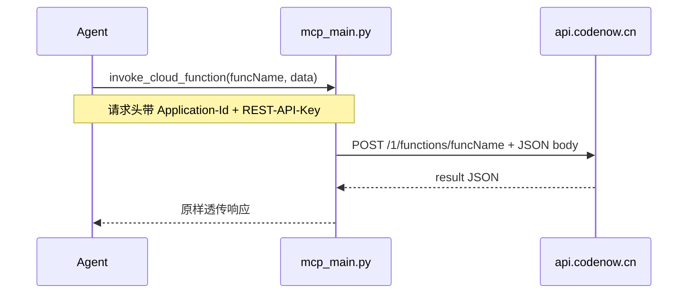

# MCP 与 Skills 云函数执行支持

## 背景与目标

当前 [`mcp_main.py`](file:///Users/magic/Documents/bmob/bmob-web/mcp.bmobapp.com/mcp_main.py) 的 `generate_code` 在 `调用云函数` 分支**已能生成**正确的 REST curl：

```762:769:/Users/magic/Documents/bmob/bmob-web/mcp.bmobapp.com/mcp_main.py
        elif type == '调用云函数':
            return JSONResponse(content=f"""
                curl -X POST \
                    -H "X-Bmob-Application-Id: {headers['X-Bmob-Application-Id']}" \
                    -H "X-Bmob-REST-API-Key: {headers['X-Bmob-REST-API-Key']}" \
                    -H "Content-Type: application/json" \
                    -d '{data}' \
                    https://api.codenow.cn/1/functions/{funcName}
```

**缺口**：只能生成 curl，不能在 IDE 内**直接执行**云函数（对比已有 `deploy_static_site` 可实际部署）。

**更正后的调用方式**（用户确认）：

| 项 | 值 |
|----|-----|
| 域名 | `https://api.codenow.cn`（REST API，**非** `cloud.codenow.cn`） |
| 路径 | `POST /1/functions/<funcName>` |
| 鉴权 | `X-Bmob-Application-Id` + `X-Bmob-REST-API-Key`（沿用 MCP 现有配置） |
| Body | `application/json`，无参时传 `{}` |
| Secret Key | **不需要**，URL 中无 pathKey |

REST 官方文档明确云函数调用为 **POST only**（[cloud_function/restful](file:///Users/magic/Documents/bmob/BmobDocs/mds/cloud_function/restful/index.md)），故不实现 GET 模式。



## 1. MCP Server 实现（[`mcp_main.py`](file:///Users/magic/Documents/bmob/bmob-web/mcp.bmobapp.com/mcp_main.py)）

### 1.1 新工具 `invoke_cloud_function`

参考 [`deploy_static_site`](file:///Users/magic/Documents/bmob/bmob-web/mcp.bmobapp.com/mcp_main.py)（L792-814）新增端点：

| 项 | 值 |
|----|-----|
| 路径 | `GET /invoke_cloud_function`（与现有 CRUD 工具一致，便于 MCP GET 代理） |
| `operation_id` | `invoke_cloud_function` |
| 参数 | `funcName`（必填）、`data`（可选 JSON 字符串，默认 `{}`） |

**行为：**

1. `headers = await get_application_info(request)`；缺头则 400 `{"error": "unauthorized"}`
2. `data` 解析为 dict（非法 JSON 返回 400）
3. `requests.post(f'{BMOB_API_BASE}/1/functions/{funcName}', headers=headers + Content-Type: application/json, json=parsed_data)`
4. 将上游 status + body 透传给 agent（`response.json()` 失败时 fallback 文本）

**上游 URL**（复用已有常量）：

```
POST https://api.codenow.cn/1/functions/{funcName}
```

更新 FastAPI MCP `description` 摘要，加入触发词：`调用云函数`、`执行云函数`、`invoke cloud function`、`run cloud function`。

### 1.2 `generate_code` — 无需改动

现有 `调用云函数` type 已对齐 REST 形态，**不新增** `调用云函数GET` / `调用云函数POST`，**不增加** `pathKey` 参数。

可选微调（非必须）：在 `调用云函数` 分支说明文字中强调「无参时 data 必须为 `{}`」（与 REST 文档一致）。

### 1.3 文档

新增 [`docs/invoke-cloud-function.md`](file:///Users/magic/Documents/bmob/bmob-web/mcp.bmobapp.com/docs/invoke-cloud-function.md)：

- REST 调用规格：`POST api.codenow.cn/1/functions/<name>`
- 与 `cloud.codenow.cn` 直连 HTTP（Secret Key 在 URL、支持 GET）的**区别**——MCP 走 REST 通道
- `invoke_cloud_function` 工具示例
- `generate_code?type=调用云函数` 示例
- 成功响应 `{"result": ...}` 与常见错误

更新 [`docs/README.md`](file:///Users/magic/Documents/bmob/bmob-web/mcp.bmobapp.com/docs/README.md) 工具表。

## 2. Agent Skills 更新（[`bmob-agent-skills`](file:///Users/magic/Documents/bmob/bmob-agent-skills)）

### 2.1 [`skills/bmob-mcp/SKILL.md`](file:///Users/magic/Documents/bmob/bmob-agent-skills/skills/bmob-mcp/SKILL.md)

- `description` 与正文：工具数 **8 → 9**（agent 可调用 **7 → 8**）
- 触发词增加：`调用云函数`、`执行云函数`、`invoke cloud function`
- 「何时用 MCP」表增加：IDE 内试跑云函数 → `invoke_cloud_function`；生成 curl → 现有 `generate_code` → `调用云函数`
- 新增 **§ `invoke_cloud_function`**：

```json
{
  "inputSchema": {
    "type": "object",
    "required": ["funcName"],
    "properties": {
      "funcName": { "type": "string", "description": "云函数名称，如 rsync_img" },
      "data":     { "type": "string", "description": "JSON 参数字符串，无参传 \"{}\"" }
    }
  }
}
```

### 2.2 [`shared/operation-routing.md`](file:///Users/magic/Documents/bmob/bmob-agent-skills/shared/operation-routing.md)

更新「用户、短信、云函数、文件」表：

| 用户意图 | MCP 工具 | `generate_code` type |
|----------|----------|----------------------|
| 执行 / 试跑云函数 | **`invoke_cloud_function`** | — |
| 生成云函数 curl | — | `调用云函数` |

「MCP 可调用工具 × 用户话术」表增加：执行云函数 / 跑一下 rsync_img → `invoke_cloud_function`。

### 2.3 其它 skills 触点

- [`skills/bmob/SKILL.md`](file:///Users/magic/Documents/bmob/bmob-agent-skills/skills/bmob/SKILL.md)：MCP 工具数量；「调用已有云函数」路由改为 `invoke_cloud_function`（执行）+ `generate_code`（curl）
- [`README.zh-CN.md`](file:///Users/magic/Documents/bmob/bmob-agent-skills/README.zh-CN.md) / [`README.md`](file:///Users/magic/Documents/bmob/bmob-agent-skills/README.md)：工具列表
- **不修改** `url-cheatsheet.md`（已正确记录 `POST /1/functions/<functionName>`）

### 2.4 测试

更新 [`tests/mcp-smoke.test.ts`](file:///Users/magic/Documents/bmob/bmob-agent-skills/tests/mcp-smoke.test.ts) 的 `EXPECTED` 数组，加入 `invoke_cloud_function`。

## 3. 不在本次范围

- `cloud.codenow.cn` 直连 HTTP（Secret Key 在 URL、GET 无鉴权头）— 非 REST 通道，MCP 不实现
- 新增 `generate_code` type 或 `pathKey` 参数
- 改 BmobDocs 官方文档
- 改 `main.py`（旧版入口）

## 4. 验证计划

1. 本地启动 `mcp_main.py`，`tools/list` 应含 `invoke_cloud_function`
2. POST 冒烟：

```bash
curl -G 'http://127.0.0.1:6666/invoke_cloud_function' \
  -H 'X-Bmob-Application-Id: <id>' \
  -H 'X-Bmob-REST-API-Key: <key>' \
  --data-urlencode 'funcName=rsync_img' \
  --data-urlencode 'data={"name":"tom"}'
```

3. 对照 `generate_code?type=调用云函数&funcName=rsync_img&data={"name":"tom"}` 生成的 curl 与上行为一致
4. 跑 `mcp-smoke.test.ts`

## 5. 关键设计说明

- **单一通道**：MCP 执行与 curl 生成都走 `api.codenow.cn/1/functions`，与 SDK / REST skill 一致。
- **鉴权零增量**：复用 MCP 已配置的 Application-Id + REST-API-Key，无需 Secret Key。
- **POST only**：符合 REST 云函数规范；原先提到的 GET 属于 `cloud.codenow.cn` 直连模式，本次不做。
