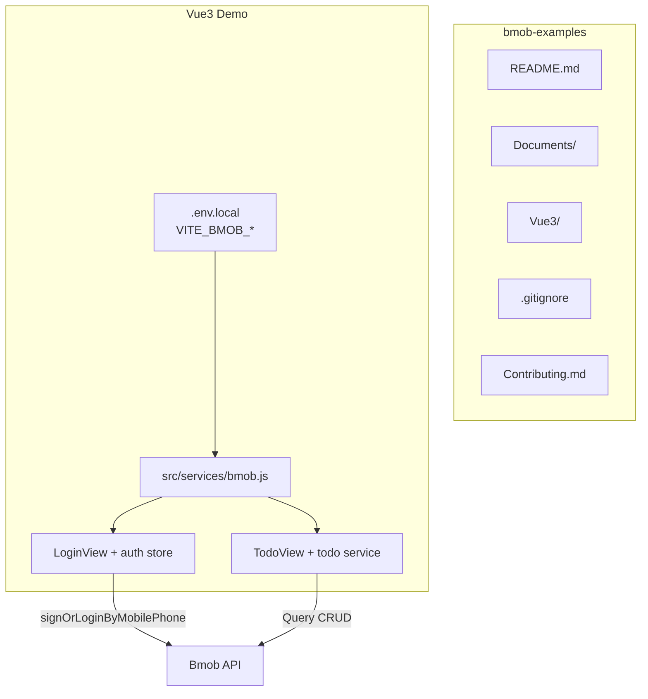
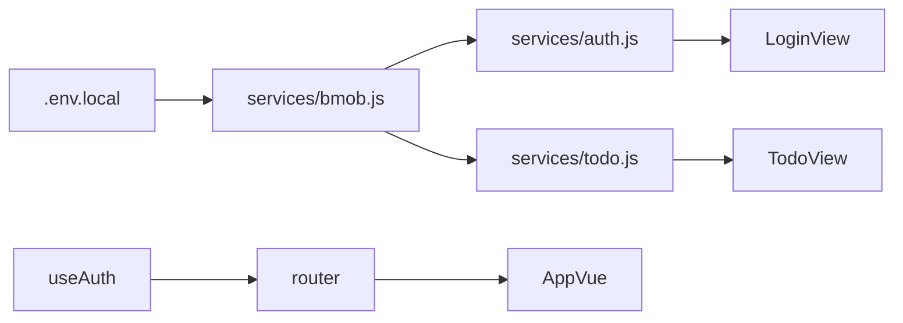

# bmob-examples Vue3 首期实现计划

## 现状

- 仓库 [`bmob-examples`](/Users/magic/Documents/bmob/bmob-examples) 目前仅有 [`LICENSE`](/Users/magic/Documents/bmob/bmob-examples/LICENSE)，无 README、无子项目。
- 关联 Bmob 应用（mcp.json 凭证）当前仅有 `_User` 表，**尚无 `TodoItem` 表**，实现阶段需通过 MCP `create_table` 创建。
- SDK：`hydrogen-js-sdk@3.0.2`（npm latest），Vue3 浏览器端通过 `npm install hydrogen-js-sdk` 引入。

## 目标架构



## 一、仓库根目录骨架

在根目录创建以下文件，并**预先创建所有平台空目录**（每个目录放 `README.md` 占位，告知「示例开发中，后续补充」）：

| 路径 | 内容 |
|------|------|
| [`README.md`](/Users/magic/Documents/bmob/bmob-examples/README.md) | 总导航：各 Demo 目录表、Node 18+ / 各端环境要求、SDK 版本矩阵、分支策略（`main`=稳定示例，`dev`=开发中平台） |
| [`.gitignore`](/Users/magic/Documents/bmob/bmob-examples/.gitignore) | 全局过滤：`node_modules/`、`dist/`、`build/`、`.env.local`、`.idea/`、`*.xcworkspace`、`Pods/`、`DerivedData/`、`.DS_Store`、`*.log`、各端构建缓存 |
| [`Contributing.md`](/Users/magic/Documents/bmob/bmob-examples/Contributing.md) | PR 规范、示例代码风格、禁止提交真实密钥 |
| [`Documents/Common/README.md`](/Users/magic/Documents/bmob/bmob-examples/Documents/Common/README.md) | ACL / Pointer / 实时订阅 / 云函数名词解释 |
| [`Documents/QuickStart.md`](/Users/magic/Documents/bmob/bmob-examples/Documents/QuickStart.md) | 通用一分钟跑通步骤（克隆 → 配密钥 → 安装依赖 → 启动） |
| [`Documents/FAQ.md`](/Users/magic/Documents/bmob/bmob-examples/Documents/FAQ.md) | key 填错 401、短信未开通、CORS、网络权限等 |
| [`.github/workflows/vue3-ci.yml`](/Users/magic/Documents/bmob/bmob-examples/.github/workflows/vue3-ci.yml) | Vue3 子目录 `npm ci && npm run build`（PR 时校验可构建） |

### 平台空目录（本期仅 README 占位）

以下目录全部创建，各含 `README.md`（状态徽章 + 一句话说明 + 链接回根 README）：

```
Android-Kotlin/        Android-Java/
iOS-ObjC/              iOS-Swift/
Flutter-Demo/
React/                 Web-JS-SDK/
Wechat-MiniProgram/    Alipay-MiniProgram/
NodeJS-Server-Demo/    Python-SDK-Demo/    PHP-SDK-Demo/
HarmonyOS-Demo/
```

占位 README 模板要点：
- 标题：`{平台名} 示例（开发中）`
- 正文：该端 Todo CRUD + 手机号验证码登录示例将在后续版本补充，请关注仓库更新或提交 Issue/PR 参与贡献
- 链接：→ [`Documents/QuickStart.md`](../Documents/QuickStart.md)、当前可运行的 [`Vue3/`](../Vue3/)

根 README 中明确：**本期已实现 `Vue3/`，其余目录已预留结构，代码后续补充**。

## 二、Bmob 后端数据表（实现时通过 MCP 创建）

在关联应用中创建 `TodoItem` 表，与各端 Swift 示例对齐，字段：

```json
{
  "title":       { "type": "String", "note": "任务标题" },
  "content":     { "type": "String", "note": "任务描述" },
  "isCompleted": { "type": "Bool",   "note": "是否完成" },
  "priority":    { "type": "Number", "note": "优先级 1低 2中 3高" },
  "author":      { "type": "Pointer", "targetClass": "_User", "note": "创建者" }
}
```

控制台还需确认：**短信服务已开通**（否则 `requestSmsCode` 会失败，FAQ 中说明）。

## 三、Vue3 子项目结构

路径：[`Vue3/`](/Users/magic/Documents/bmob/bmob-examples/Vue3/)

```
Vue3/
├── .env.example          # 密钥占位模板
├── .gitignore            # 子目录补充（dist、.env.local）
├── package.json
├── vite.config.js
├── tailwind.config.js    # Tailwind 内容路径扫描 src/
├── postcss.config.js     # tailwindcss + autoprefixer
├── index.html
├── README.md             # Vue 专属运行说明
└── src/
    ├── main.js           # 初始化 Bmob + 挂载 Vue
    ├── style.css         # @tailwind base/components/utilities
    ├── App.vue           # 布局壳 + 路由出口
    ├── router/index.js   # /login、/todos 路由守卫
    ├── services/
    │   ├── bmob.js       # 单例初始化（方式 B）
    │   ├── auth.js       # 短信验证码 + 登录/登出
    │   └── todo.js       # TodoItem CRUD 封装
    ├── composables/
    │   └── useAuth.js    # 登录态 reactive 状态
    └── views/
        ├── LoginView.vue # 手机号 + 验证码 UI（Tailwind）
        └── TodoView.vue  # 列表 + 增删改查（Tailwind）
```

技术栈：**Vite 5 + Vue 3 + JavaScript + Vue Router 4 + Tailwind CSS 3**。

### Web 端样式规范（Tailwind）

所有 **Web 相关**示例（`Vue3/`、`React/`、`Web-JS-SDK/`）统一使用 **Tailwind CSS**，不使用 Element Plus 等 UI 库，也不手写大段 scoped CSS。

Vue3 集成步骤：
1. `npm install -D tailwindcss postcss autoprefixer`
2. `npx tailwindcss init -p`
3. `tailwind.config.js` 的 `content` 指向 `./index.html` 和 `./src/**/*.{vue,js}`
4. `src/style.css` 写入 `@tailwind base; @tailwind components; @tailwind utilities;`
5. `main.js` 中 `import './style.css'`
6. 组件内直接用 utility class，如 `class="flex flex-col gap-4 p-6 max-w-md mx-auto"`

后续 `React/`、`Web-JS-SDK/` 占位目录 README 中也会注明将沿用同一 Tailwind 规范。

### 密钥配置

使用 mcp.json 中的 **方式 B**（Application ID + REST API Key）：

- [`.env.example`](/Users/magic/Documents/bmob/bmob-examples/Vue3/.env.example)：
  ```
  VITE_BMOB_APPLICATION_ID=your_application_id
  VITE_BMOB_REST_API_KEY=your_rest_api_key
  ```
- 实现时从 mcp.json 写入本地 **`.env.local`**（已在 .gitignore，**不提交 git**）
- [`src/services/bmob.js`](/Users/magic/Documents/bmob/bmob-examples/Vue3/src/services/bmob.js) 初始化：

```js
import Bmob from 'hydrogen-js-sdk'

Bmob.initialize(
  import.meta.env.VITE_BMOB_APPLICATION_ID,
  import.meta.env.VITE_BMOB_REST_API_KEY
)

export default Bmob
```

> 安全说明：方式 B 的 REST API Key 会打进浏览器 bundle；根 README / FAQ 会注明生产环境优先 Secret Key + API 安全码。本期按你指定的 mcp 凭证实现。

### 认证流程（手机号验证码注册/登录）

对齐 [BmobDocs 手机验证码登录](https://github.com/bmob/BmobDocs/blob/master/mds/data/wechat_app_new/index.md)：

| 步骤 | API |
|------|-----|
| 发送验证码 | `Bmob.requestSmsCode({ mobilePhoneNumber })` |
| 注册或登录 | `Bmob.User.signOrLoginByMobilePhone(phone, smsCode)` |
| 登出 | `Bmob.User.logout()` |
| 恢复会话 | `Bmob.User.current()` |

[`LoginView.vue`](/Users/magic/Documents/bmob/bmob-examples/Vue3/src/views/LoginView.vue)：手机号输入、60s 倒计时发码按钮、验证码输入、登录按钮；成功后跳转 `/todos`。

路由守卫：未登录访问 `/todos` → 重定向 `/login`。

### Todo CRUD（核心存储能力）

[`src/services/todo.js`](/Users/magic/Documents/bmob/bmob-examples/Vue3/src/services/todo.js) 封装标准 hydrogen-js-sdk 用法：

| 操作 | 实现 |
|------|------|
| **Create** | `Bmob.Query('TodoItem')` → `set(...)` → `save()`，写入 `author` Pointer 指向当前用户 |
| **Read** | `equalTo('author', '==', userPointer)` + `order('-createdAt')` + `find()` |
| **Update** | `set('id', objectId)` + `set(...)` → `save()`；切换完成状态同理 |
| **Delete** | `destroy(objectId)` |

[`TodoView.vue`](/Users/magic/Documents/bmob/bmob-examples/Vue3/src/views/TodoView.vue) UI：
- 顶部：当前用户手机号 + 退出
- 新增表单：标题、描述、优先级
- 列表：勾选完成、编辑、删除
- 加载/错误状态提示

### 通用能力示范（精简版，不膨胀 scope）

在 Todo 流程中顺带展示（代码注释 + README 说明）：
- **Pointer**：`author` 字段关联 `_User`
- **条件查询**：按 `isCompleted` 筛选（全部/未完成/已完成 tab）
- **ACL 提示**：创建时注释说明生产应配置行级 ACL（Documents/Common 详述）

实时订阅、云函数、文件上传留到后续平台示例或 Vue README「进阶阅读」链接，避免首期 Demo 过重。

## 四、文档内容要点

### 根 README.md
- 仓库目录树（含未实现平台占位）
- 环境要求：Node 18+、npm/yarn/pnpm
- SDK 版本表：

| 平台 | SDK | 版本 |
|------|-----|------|
| Vue3 / React / Web / 小程序 | hydrogen-js-sdk | 3.0.2 |
| Android | bmob-sdk | TBD |
| iOS | BmobSDK | TBD |
| ... | ... | ... |

- 分支说明：`main` 稳定可运行示例；`dev` 新平台开发中
- 快速入口链接 → `Documents/QuickStart.md`、`Vue3/README.md`

### Vue3/README.md
- `cp .env.example .env.local` 并填入密钥
- `npm install && npm run dev`
- 功能清单与涉及 API 对照表
- 短信测试注意事项

## 五、验证清单（实现完成后执行）

1. `cd Vue3 && npm install && npm run build` 通过
2. `npm run dev` 本地打开，发送验证码 → 登录成功
3. Todo 增删改查全流程可用，刷新页面会话保持
4. `git status` 确认 `.env.local`、`node_modules`、`dist` 均被忽略
5. GitHub Actions build 通过

## 关键文件依赖关系



## 不在本期范围

- 除 `Vue3/` 外各平台的**可运行代码**（目录与 README 占位会创建）
- Element Plus 或其他 UI 组件库（Web 端统一 Tailwind）
- 云函数部署、实时订阅完整 Demo
- 将真实密钥写入 git 或 `.env.example`
