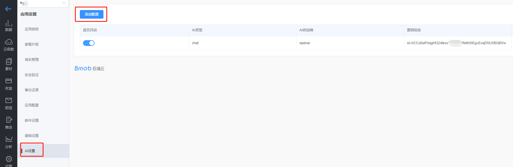

## 创建应用

登录账号进入bmob后台后，点击后台界面左上角“创建应用”，在弹出框输入你应用的名称，然后确认，你就拥有了一个等待开发的应用。


## 获取应用密钥

选择你要开发的应用，进入该应用


在跳转页面，进入设置/应用密钥，点击复制，即可得到`Application ID`


##  导入依赖

在`app`的`build.gradle`文件中添加`依赖文件`：
```gradle
dependencies {
	implementation 'io.github.bmob:android-sdk:3.9.4'
	implementation 'io.reactivex.rxjava2:rxjava:2.2.8'
	implementation 'io.reactivex.rxjava2:rxandroid:2.1.1'
	implementation 'com.squareup.okhttp3:okhttp:4.8.1'
	implementation 'com.squareup.okio:okio:2.2.2'
	implementation 'com.google.code.gson:gson:2.8.5'
}
```

## 创建Application子类
新建一个继承自`Application`的子类`BmobApp`。代码如下：

```java
public class BmobApp extends Application {
    public static BmobAI bmobAI;

    @Override
    public void onCreate() {
        super.onCreate();
        //初始化
        Bmob.initialize(this,"你的application id");
		//初始化AI（初始化时，会自动创建一个websocket，保持心跳连接，确保实时回复）
        bmobAI = new BmobAI();
    }
}
```

## 配置AndroidManifest.xml

在你的应用程序的`AndroidManifest.xml`文件中添加如下的`应用类名`、`权限`和`ContentProvider`信息：


```xml
<?xml version="1.0" encoding="utf-8"?>
    <manifest xmlns:android="http://schemas.android.com/apk/res/android"
    	package="cn.bmob.example"
    	android:versionCode="1"
    	android:versionName="1.0">

    <uses-sdk android:minSdkVersion="8" android:targetSdkVersion="17"/>

	<!--允许联网 -->
	<uses-permission android:name="android.permission.INTERNET" />
	<!--获取GSM（2g）、WCDMA（联通3g）等网络状态的信息  -->
	<uses-permission android:name="android.permission.ACCESS_NETWORK_STATE" />
	<!--获取wifi网络状态的信息 -->
	<uses-permission android:name="android.permission.ACCESS_WIFI_STATE" />

    <application
		android:name=".BmobApp"
        ....其他信息>
        <activity
            ...其他信息
		</activity>

		<!--添加ContentProvider信息 -->
		<provider
			android:name="cn.bmob.v3.util.BmobContentProvider"
			android:authorities="你的应用包名.BmobContentProvider">
		</provider>
    </application>
</manifest>
```

## 调用AI对话

```java

//连接AI服务器（这个代码为了防止AI连接中断，因为可能会存在某些情况下，比如网络切换、中断等，导致心跳连接失败）
BmobApp.bmobAI.Connect();
//发送对话信息
BmobApp.bmobAI.Chat("帮我用写一段android访问Bmob后端云的代码", "session_id", new ChatMessageListener() {
    @Override
    public void onMessage(String message) {
		//消息流的形式返回AI的结果
        Log.d("Bmob", message);
    }

    @Override
    public void onFinish(String message) {
		//一次性返回全部结果，这个方法需要等待一段时间，友好性较差
        Log.d("Bmob", message);
    }

    @Override
    public void onError(String error) {
		//OpenAI的密钥错误或者超过OpenAI并发时，会返回这个错误
        Log.d("Bmob", "连接发生异常了"+error);
    }

    @Override
    public void onClose() {
        Log.d("Bmob", "连接被关闭了");
    }
});
```

其中，`session_id`是会话Id信息，你可以传入用户的`objectId`，也可以是其他固定的信息，如用户的`手机号码`、`注册账号`等等。后端根据会话Id信息，自动拼接相应的上下文信息，发送给GPT进行处理。
`onMessage`方法是以流的形式，不断回传`message`信息给你，呈现在UI界面上。通过这种方法，你可以实现更好的用户体验。
`onFinish`方法是等待GPT完全请求完毕，才回传最终内容`message`给你。
`onError`和`onClose`方法是请求连接发生错误时调用，如网络关闭等。


- BmobAI的其他方法
  
`BmobAI`类还有`isConnect`方法和`Connect`方法。

`isConnect`方法返回布尔值，表示是否和服务器保持着连接状态。

`Connect`方法是主动和服务器连接的方法，主要是当你的网络发生异常时，主动重新和服务器进行连接。

## 自定义AI机器人

如果需要设置AI的角色，你可以在调用 `BmobApp.bmobAI.Chat` 方法前，调用  `BmobApp.bmobAI.setPrompt` 方法，如：

```java

BmobApp.bmobAI.setPrompt("接下来的每个回复都要叫我宝贝");

```

## 清除Session

SDK会在 `内存` 中保存会话(session)信息，每次执行 `BmobAI.Chat` 方法时，会自动找到最近的 `7对` 上下文（17条对话），组装好内容，和最终的AI服务商交互。

如果你不想携带以往的会话(session)信息，可以在执行 `BmobAI.Chat` 方法之前，先执行  `BmobAI.Clear("你的session名称")` 方法，将session信息从内存中清除。

## 接口费用

免费赠送1000条。

超过1000条，可以选择购买（1分钱一条）或者使用自有的密钥。

使用自有密钥的方法如下：进入到应用之后，依次点击 `设置` -> `AI设置` -> `添加配置`，将你的密钥信息填上去即可。


## 视频教程

<iframe src="//player.bilibili.com/player.html?aid=998743296&bvid=BV11x4y1d7Nk&cid=1202328961&page=1" width="800" scrolling="no" border="0" frameborder="no" framespacing="0" allowfullscreen="true"> </iframe>

## 源码下载
[AI快速入门源码下载](https://github.com/bmob/Bmob-Android-AI)

[AI角色案例](https://github.com/bmob/Bmob-Android-AI-Prompt)