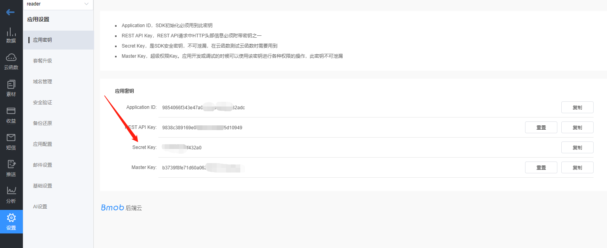

## 技术方案

Bmob AI为了兼容国内所有的平台，抛弃了Chatgpt采用的EventSource协议方案，仍然采用传统的WebSocket协议进行网络数据的实时传输。

`WebSocket`和`EventSource`协议的优劣势及Bmob采用WebSocket协议的具体原因大家可以查看技术文档：[为什么建议国内的AI对话服务不采用EventSource协议？](https://juejin.cn/post/7256975111563214905)。

接下来的文档按WebSocket通讯的几个环节进行：
- 连接WebSocket服务器
- 发送对话信息
- 接收AI回复信息
- 保持心跳连接

## 连接WebSocket服务器

WebSocket服务器的连接地址是：` wss://api.codenow.cn/1/ai/<secret key> `

这里需要注意的地方是：
- 请求协议是` wss `安全协议
- 如果你有自己的备案域名，建议将 `api.codenow.cn` 域名变更为你自己的api备案域名。 
- `<secret key>` 要替换为你在控制台中创建的应用的`Secret Key`，如下图：
  


## 发送对话消息

连接成功之后，即可发送对话消息。

对话消息的格式为`json`格式，样例如下：

```
{
    "messages":
        [
            {"content":"接下来的每一个回复，你都要叫我宝贝","role":"system"},
            {"content":"你好","role":"user"},
            {"content":"你好宝贝！今天过得怎么样？有什么开心的事情要和我分享吗？","role":"assistant"},
            {"content":"没有","role":"user"}
        ],
    "session":"test_user"}
```

其中，`messages`是聊天的上下文信息，`content`是内容，`role`是角色。角色包含三种：

- `system` 系统角色，通常放在messages对话数组的第一个位置，也就是我们常说的`prompt`。
- `user` 提问者角色。
- `assistant` 回答者角色，也就是chatgpt的回复内容。
  
`session`为会话标记，它的值你可以自定义，通常设定为用户的标记信息，如用户id或者手机号之类的。

你可以`不包含`prompt信息，这样的话，发送聊天的第一句的`json`消息就非常简单，样例如下：

```
{
    "messages":
        [
            {"content":"你好","role":"user"}
        ],
    "session":"test_user"}
```

## 接收AI回复信息

发送对话信息之后，很快就会收到AI的回复信息。AI的回复信息是以流的形式，持续不断地发回对话结果。

接收到的回复信息一般如下，其中，`content`为回复的内容：

```
{"id":"chatcmpl-7eb5Y7f5bRmIKZmqo1PHX5BmHR6VP","object":"chat.completion.chunk","created":1689910044,"model":"gpt-3.5-turbo-0613","choices":[{"delta":{"role":"","content":"亲"},"index":0,"finish_reason":""}]}
```

当输出结束的时候，会收到如下的json包，即`finish_reason`的值标记为`stop`：

```
{"id":"chatcmpl-7eb5Y7f5bRmIKZmqo1PHX5BmHR6VP","object":"chat.completion.chunk","created":1689910044,"model":"gpt-3.5-turbo-0613","choices":[{"delta":{"role":"","content":""},"index":0,"finish_reason":"stop"}]}
```

## 保持心跳连接

为确保数据双通道通讯，你还需要和Bmob的AI服务器保持心跳连接，也就是俗称的`ping pong`。

### Ping

建议30秒发送一个`ping`字符串到WebSocket上面。

### Pong

服务器收到ping包之后，会回复一个`json`格式的pong出来，格式如下：

```
{"success":"ok"}
```