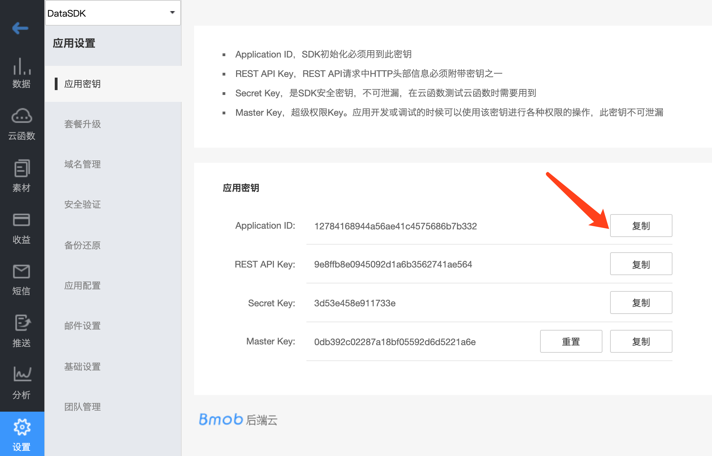

## 创建应用

登录账号进入bmob后台后，点击后台界面左上角“创建应用”，在弹出框输入你应用的名称，然后确认，你就拥有了一个等待开发的应用。


## 获取应用密钥

选择你要开发的应用，进入该应用


在跳转页面，进入设置/应用密钥，点击复制，即可得到`Application ID`



##  导入依赖

在`app`的添加`依赖文件`：
```gradle
dependencies: [
    .package(url: "https://github.com/bmob/BmobChatAi", from: "1.0.0")
]
```

## 使用

要使用这个包，首先在 Swift 文件中导入它：

```
import BmobChatAi
```

然后，创建一个 `BmobChatAi` 实例，并开始使用其 chatgpt ai 功能：

```
// 实例化AI类
let chatAI = BmobChatAi(SecretKey: "xxxxx")

// 连接AI
chatAI.connect()
//连接websock 域名参数可不传
chatAI.connect("https://api.xxxxx.com")

// 发送一条消息给 chatgpt ai
let dictionary: [String: Any] = [
              "messages": [
                [
                  "content": "你好，你怎么样？",
                  "role": "user"
                ]
              ],
              "session": "b1"
            ]


 if let jsonData = try? JSONSerialization.data(withJSONObject: dictionary),
	 let jsonString = String(data: jsonData, encoding: .utf8) {
   // use jsonString as you want
   bmobChatAi.send(message: jsonString)
  }

// 接收来自 chatgpt ai 的消息
chatAI.onReceiveMessage = { message in
		print("收到的消息：\(message)")
}
```

## 错误处理

```
        chatAI.onError = { error in
            // 处理 WebSocket 连接中的错误
            print("WebSocket \(error) 连接出现错误：\(error.localizedDescription)")
            self.chatAI.connect()
        }
```

## Send方法内容说明

// session 会话id，可以传用户objectId，或者随机数 // content 内容，提问的内容，如果希望上下文，可以这样传入 // {"model":"gpt-3.5-turbo","messages":[{"content":"你好","role":"user"},{"content":"你好，有什么我可以为你提供的帮助吗？","role":"assistant"},{"content":"请问Bmob是什么产品","role":"user"}]}

为了实现场景化答复，可以传入prompt 参数

ChatGPT Prompt 是一种基于 GPT 模型的自然语言处理技术，用于生成自然流畅的对话文本。它可以通过给定的对话上下文和提示语，生成符合上下文语境的新对话内容。

ChatGPT Prompt 可以被广泛应用于聊天机器人、客服系统、智能问答等领域，帮助用户快速构建自然语言应用程序。

与传统的对话系统不同，使用 ChatGPT Prompt 生成的对话文本更加贴近自然语言表达，可以让用户感受到更加真实的对话体验。同时，ChatGPT Prompt 还可以学习和适应用户的对话习惯和语言习惯，为用户提供更加个性化的服务。

在使用 ChatGPT Prompt 时，需要提供一个对话上下文，该上下文包含了当前对话的历史记录和相关信息。然后，通过给定的提示语，ChatGPT Prompt 将根据上下文生成符合语境的新对话内容。

需要注意的是，由于 ChatGPT Prompt 是基于 GPT 模型的，因此需要大量的语料库和训练数据来训练模型，并且需要具备一定的计算资源来支持模型的训练和推理。同时，由于自然语言处理技术的复杂性，ChatGPT Prompt 也可能存在一定的误差和不准确性。因此，在使用 ChatGPT Prompt 时需要进行适当的调试和优化。

### 设置prompt

设置prompt后，每次发送的消息都会带上下面格式

{"model":"gpt-3.5-turbo","messages":[{"content":"从现在开始，你将扮演一个18禁成人恋爱游戏中的女主角，你的答案听起来不应该像机器语言，而是应该灵活自由。","role":"system"},{"content":"你好，有什么我可以为你提供的帮助吗？","role":"assistant"}]}

通过代码设置

```
chatAI.setPrompt("从现在开始，你将扮演一个18禁成人恋爱游戏中的女主角，你的答案听起来不应该像机器语言，而是应该灵活自由。")
```


> 每次消息带上第一个数组元素

## 接口费用

免费赠送1000条。

超过1000条，可以选择购买（1分钱一条）或者使用自有的密钥。

使用自有密钥的方法如下：进入到应用之后，依次点击 `设置` -> `AI设置` -> `添加配置`，将你的密钥信息填上去即可。


## 源码下载
[AI快速入门源码下载](https://github.com/bmob/Bmob-Android-AI)

[AI角色案例](https://github.com/bmob/Bmob-Android-AI-Prompt)