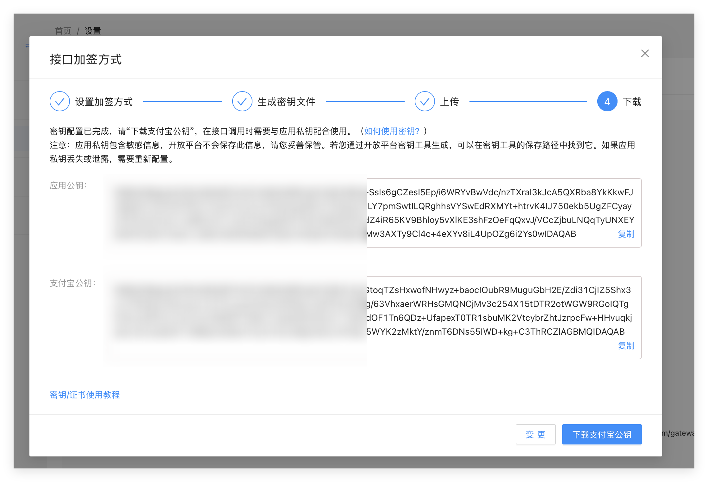
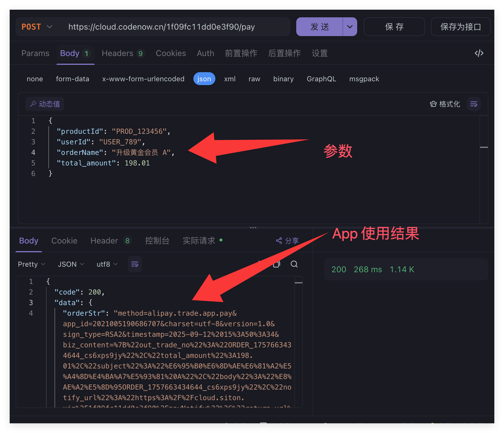

## 简介

本教程将引导你完成如下的支付宝 App 接入任务，实现一个 App 支付功能：

- 把订阅者发送到公众号后台的反馈意见存储在在Bmob中的 `message` 表。
- 收到反馈意见后，公众号自动给订阅者发送消息，表示消息已收到。
- 小程序网页也是一样的，查看支付宝开发文档


## 一、前置准备

### 1.1 支付宝开放平台配置

- 1.1.1 注册 / 登录支付宝开放平台账号（[https://open.alipay.com](https://open.alipay.com/)）
- 1.1.2 创建应用（选择 “自研应用”，应用类型为 “APP”）
- 1.1.3 应用状态激活（完成实名认证、签约 “APP 支付” 能力）


### 1.2 密钥获取与配置

- 1.2.1 生成密钥对（推荐使用支付宝开放平台提供的 “密钥生成工具”）
  - 下载地址：[支付宝开放平台文档中心 - 密钥工具](https://opendocs.alipay.com/open/291/105971)
  - 生成方式：选择 “RSA2” 加密方式，生成 PKCS8 格式密钥（Node.js 环境推荐）
- 1.2.2 配置公钥到支付宝开放平台
  - 登录应用→开发设置→接口加签方式→上传 “应用公钥”
  - 保存并获取 “支付宝公钥”（用于验签）

查看密钥



### 1.3 Bmob 环境准备

- 1.3.1 云函数创建（新建`alipayPayment`云函数）

- 1.3.2 依赖（云函数使用的是` alipay-sdk`3.6 版本，请查看 3.6 版本文档 https://www.npmjs.com/package/alipay-sdk/v/3.6.2）

- 1.3.3 数据表设计（`Order`表字段规范）
  - 必选字段：`outTradeNo`（支付订单号）、`totalAmount`（金额，分）、`status`（订单状态）等
  - 关联字段：`userId`（用户 ID）、`productId`（商品 ID）等

### 1.4 数据表设计（Order 表）

| 字段名      | 数据类型 | 列注释                           | 默认值 | 约束 / 说明                                   |
| ----------- | -------- | -------------------------------- | ------ | --------------------------------------------- |
| **id**      | Number   | 订单 id（自增主键）              | 未设置 | 自增唯一值，用于订单唯一标识（Bmob 自动生成） |
| productId   | String   | 商品 id                          | 未设置 | 关联商品表的唯一标识                          |
| status      | Number   | 订单状态（0：未支付；1：已支付） | 未设置 | 默认为空，创建订单时需指定初始状态            |
| userId      | String   | 用户 id                          | 未设置 | 关联用户表的唯一标识                          |
| playDate    | Date     | 支付时间                         | 未设置 | 支付成功后更新，格式为 `YYYY-MM-DD HH:mm:ss`  |
| orderDate   | Date     | 下单时间                         | 未设置 | 创建订单时自动填充当前时间                    |
| playType    | Number   | 支付方式（0：支付宝；1：微信）   | 未设置 | 区分不同支付渠道                              |
| discount    | Number   | 优惠折扣（如 0.9 表示 9 折）     | 未设置 | 支持小数，无折扣时可设为 1                    |
| orderNum    | String   | 订单编号（外部支付系统用）       | 未设置 | 全局唯一，格式为 `ORDER_时间戳_随机字符串`    |
| orderName   | String   | 订单名称                         | 未设置 | 对应支付接口的 `subject` 字段                 |
| totalAmount | Number   | 订单金额（单位：分）             | 0      | 以分为单位存储，避免浮点数精度问题            |

#### 字段设计说明：

1. **id（主键）**
   - Bmob 会自动生成自增唯一的 `objectId`（字符串类型），若需显式使用数字类型主键，可在创建表时开启「自增 ID」功能
   - 用途：内部系统关联订单（如查询、更新订单状态）
2. **orderNum 与 id 的区别**
   - `id`：内部系统用主键，仅用于 Bmob 数据表操作
   - `orderNum`：外部支付系统用编号，需传递给支付宝 / 微信支付接口（对应 `out_trade_no`）
3. **totalAmount 设计**
   - 单位为「分」，存储整数（如 19800 表示 198.00 元）
   - 避免使用小数存储金额，防止计算精度问题（如 0.01 元的误差）
4. **时间字段**
   - `orderDate`：创建订单时必须填充（建议用当前时间）
   - `playDate`：支付成功后由异步通知回调更新，未支付时为空
5. **状态字段**
   - `status` 与 `playType` 均使用 Number 类型，便于后续扩展状态（如新增「已取消」状态码 2）


## 二、核心功能开发

### 2.1 云函数入口设计

云函数入口接收客户端请求参数，处理后返回标准化响应格式，确保前后端交互一致性。

#### 2.1.1 请求参数规范（`request.body`字段说明）

客户端需通过 `request.body` 传递以下 JSON 格式参数：

| 参数名         | 数据类型 | 是否必填 | 说明                                 | 示例值             |
| -------------- | -------- | -------- | ------------------------------------ | ------------------ |
| `productId`    | String   | 是       | 商品唯一标识，关联商品表             | `"PROD_123456"`    |
| `userId`       | String   | 是       | 用户唯一标识，关联用户表             | `"USER_789"`       |
| `orderName`    | String   | 是       | 订单标题，将作为支付接口的 `subject` | `"数据恢复产品 A"` |
| `total_amount` | Number   | 是       | 订单总金额（单位：元），支持两位小数 | `198.01`           |

**请求参数示例**：

json

```json
{
  "productId": "PROD_123456",
  "userId": "USER_789",
  "orderName": "数据恢复产品 A",
  "total_amount": 198.01
}
```

#### 2.1.2 响应格式定义

云函数处理完成后，返回标准化 JSON 响应，包含状态码、业务数据和描述信息：

| 字段名 | 数据类型 | 说明                                                     | 取值范围                      |
| ------ | -------- | -------------------------------------------------------- | ----------------------------- |
| `code` | Number   | 响应状态码： - 200：成功 - 400：参数错误 - 500：系统错误 | `200`/`400`/`500`             |
| `data` | Object   | 业务数据对象，成功时返回支付相关信息                     | 成功时非空，失败时可为 `null` |
| `msg`  | String   | 响应描述信息，说明操作结果                               | 成功 / 错误提示文本           |

**`data` 对象字段说明**：

| 字段名       | 数据类型 | 说明                                           | 示例值                                                      |
| ------------ | -------- | ---------------------------------------------- | ----------------------------------------------------------- |
| `orderStr`   | String   | 支付宝支付请求字符串，客户端需传递给支付宝 SDK | `"method=alipay.trade.app.pay&app_id=2021005190686707&..."` |
| `outTradeNo` | String   | 商户生成的唯一订单号，用于跟踪支付状态         | `"ORDER_1757663434644_cs6xps9jy"`                           |

**成功响应示例**：

```json
{
  "code": 200,
  "data": {
    "orderStr": "method=alipay.trade.app.pay&app_id=xxxx&charset=utf-8&version=1.0&sign_type=RSA2&timestamp=2025-09-12%2015%3A50%3A34&biz_content=%7B%22out_trade_no%22%3A%22ORDER_1757663434644_cs6xps9jy%22%2C%22total_amount%22%3A198.01%2C%22subject%22%3A%22%E6%95%B0%E6%8D%AE%E6%81%A2%E5%A4%8D%E4%BA%A7%E5%93%81%20A%22%2C%22body%22%3A%22%E8%AE%A2%E5%8D%95ORDER_1757663434644_cs6xps9jy%22%2C%22notify_url%22%3A%22https%3A%2F%2Fcloud.siton.xin%2F1f09fc11dd0e3f90%2FpayNotify%22%2C%22return_url%22%3A%22https%3A%2F%2Fcloud.siton.xin%2F1f09fc11dd0e3f90%2FpayNotify%22%2C%22product_code%22%3A%22QUICK_MSECURITY_PAY%22%2C%22timeout_express%22%3A%2230m%22%7D&sign=Z5GgIZGgji4vJ%2B%2B3ELiE9f6WvGKYc8RriqfiM8IFNBS13129nzHlYo8EOR0m5BAEvuCqp3Ro80zFDZmHgJoaX8FerkBfOOUz4bkc8q6fOLy2EYlIGoF%2B6%2FXB2DBdK4Ur32GylUk4Rb6we41ITH1j7Y2wVKb5aqnxu2D3HHvjPEZvW8FiF%2B7%2F7%2FBYtkLytDE2c1X2Jtb3z%2Fnq72C%2B7asrs00p1k5XeQlloGoMOj4wIqTkCFFc7kaQamRZa5p2TAHiGRutAEbWzZRgRrOomOWcamFdoXY7Q4IORRBQkfW%2FfEGpX9syX0BCYslixailneebiyjv0vLUgYizVbVWs%2BoUng%3D%3D",
    "outTradeNo": "ORDER_1757663434644_cs6xps9jy"
  },
  "msg": "支付信息获取成功"
}
```

**错误响应示例（系统异常）**：

```json
{
  "code": 500,
  "data": null,
  "msg": "创建订单记录失败，请稍后重试"
}
```

#### 设计说明

1. **参数精简**：仅保留业务必需的 4 个请求参数，减少客户端传递成本
2. **类型明确**：`total_amount` 定义为 Number 类型，支持小数金额（如 `198.01`）
3. **响应标准化**：成功 / 错误响应格式统一，便于客户端统一解析处理
4. **关联性**：`outTradeNo` 与订单表的 `orderNum` 字段一一对应，用于后续支付状态同步


### 2.2.生成支付订单代码

#### 2.2.1  生成支付订单（函数名：pay）

完整可用的代码，创建一个名为"pay"的云函数用于实现支付功能，并且保存订单到订单表，这里调用了另外一个数据表新增函数

代码如下：

```js
function onRequest(request, response, modules) {
    // 防止重复发送响应
    let isResponseSent = false;
    const sendResponse = (code, data, msg) => {
        if (!isResponseSent) {
            isResponseSent = true;
            response.send({ code, data, msg });
        }
    };

    try {
        // 1. 引入依赖和初始化
        const AlipaySdk = require('alipay-sdk').default;
        const functions = modules.oFunctions;

        // 2. 支付宝配置
        const config = {
            appId: '2021xxx',
            privateKey: ``,
            // 支付宝公钥 - 请填写支付宝公钥（注意：这里需要的是公钥格式，不是证书格式）
            alipayPublicKey: ``,
            keyType: 'PKCS8',
            signType: 'RSA2',
            gateway: 'https://openapi.alipay.com/gateway.do',
            timeout: 30000
        };

        // 3. 参数验证（订单表所需参数）
        const {
            productId,
            userId,
            orderName,
            total_amount, // 支付金额（从请求体获取）
            body // 订单描述（可选）
        } = request.body;

        // 验证必要参数
        const requiredParams = [
            productId, userId, orderName, total_amount
        ];
        if (requiredParams.some(param => param === undefined || param === null || param === '')) {
            return sendResponse(400, null, "参数不完整，请检查必填字段");
        }

        // 4. 生成唯一订单号（用于支付系统）
        const outTradeNo = `ORDER_${Date.now()}_${Math.random().toString(36).substr(2, 9)}`;

        // 5. 先调用addOrder函数创建订单表记录
        console.log('开始创建订单表记录...');
        functions.run({
            name: "addOrder",
            data: {
                productId,
                userId,
                orderName,
                outTradeNo, // 将支付订单号关联到订单表
                totalAmount: total_amount // 记录订单金额
            }
        }, function (err, addOrderResult) {
            if (err) {
                console.error('创建订单表失败:', err);
                return sendResponse(500, null, "创建订单记录失败，请稍后重试");
            }

            console.log('订单表创建成功，开始创建支付订单...', addOrderResult, err);

            // addOrderResult  {"createdAt":"2025-09-12 15:32:41","objectId":"4313ac6aa3"}
            try {
                // 将字符串转换为对象
                let orderData;
                if (typeof addOrderResult === 'string') {
                    orderData = JSON.parse(addOrderResult);
                } else {
                    orderData = addOrderResult;
                }

                // 验证objectId是否存在
                if (!orderData || !orderData.objectId) {
                    console.error('订单创建结果中缺少objectId:', orderData);
                    return sendResponse(500, null, "创建订单记录不完整，请稍后重试");
                }
            } catch (payError) {
                console.error('创建支付订单失败:', payError);
                sendResponse(500, null, "创建支付信息失败，格式错误" + payError);
            }

            // 6. 订单表创建成功后，创建支付宝支付订单
            try {
                // 初始化支付宝SDK
                const alipaySdk = new AlipaySdk({
                    appId: config.appId,
                    privateKey: config.privateKey,
                    alipayPublicKey: config.alipayPublicKey,
                    gateway: config.gateway,
                    signType: config.signType,
                    keyType: config.keyType,
                    timeout: config.timeout
                });

                // 构建支付参数
                const payParams = {
                    out_trade_no: outTradeNo,
                    total_amount: total_amount,
                    subject: orderName, // 用订单名称作为支付标题
                    body: body || `订单${outTradeNo}`, // 支付描述
                    notify_url: 'https://cloud.siton.xin/xxxx/payNotify',
                    return_url: 'https://cloud.siton.xin/xxxx/payNotify'
                };

                // 创建APP支付订单
                const orderStr = alipaySdk.sdkExec('alipay.trade.app.pay', {
                    bizContent: {
                        ...payParams,
                        product_code: 'QUICK_MSECURITY_PAY',
                        timeout_express: '30m'
                    }
                });

                console.log('支付订单创建成功，订单号:', outTradeNo);
                sendResponse(200, {
                    orderStr,
                    outTradeNo,
                    orderId: addOrderResult.orderId // 假设addOrder返回订单ID
                }, "支付信息获取成功");

            } catch (payError) {
                console.error('创建支付订单失败:', payError);
                sendResponse(500, null, "创建支付信息失败，请稍后重试");
            }
        });

    } catch (error) {
        console.error('系统异常:', error);
        sendResponse(500, null, "系统异常，请稍后重试");
    }
}

```

这个云函数的内容暂时看不懂没关系，后面面会逐渐解释其中的含义 [支付宝支付云函数详细说明]。

这个是接口调用结果



#### 2.2.2  订单表插入数据（函数名：addOrder）

这里由上一个支付函数调用，其他地方不需要调用，功能就是创建一条订单。

```
function onRequest(request, response, modules) {
    const db = modules.oData;

    // 1. 参数验证
    const {
        productId,
        userId,
        playDate,
        orderDate,
        discount,
        orderName,
        totalAmount
    } = request.body;

    let status = 0
    let orderNum = request.body.outTradeNo

    if (!productId) {
        response.end("缺少参数: productId");
        return;
    }

    if (status === undefined) {
        response.end("缺少参数: status");
        return;
    }

    if (!userId) {
        response.end("缺少参数: userId");
        return;
    }

    if (!orderNum) {
        response.end("缺少参数: orderNum");
        return;
    }

    if (!orderName) {
        response.end("缺少参数: orderName");
        return;
    }
    
    let intTotaAmount =parseFloat(totalAmount);
    // 验证转换结果
    if (isNaN(intTotaAmount) || intTotaAmount <= 0) {
        response.end("金额格式无效: intTotaAmount");
        return;
    }

    // 2. 构造订单数据对象
    const orderData = {
        productId,
        status,
        userId,
        orderNum,
        totaAmount:intTotaAmount,
        orderName
    };
    
    //   当前 时间
    const formatCurrentTime = () => {
        const date = new Date();
        const year = date.getFullYear();
        const month = String(date.getMonth() + 1).padStart(2, '0');
        const day = String(date.getDate()).padStart(2, '0');
        const hours = String(date.getHours()).padStart(2, '0');
        const minutes = String(date.getMinutes()).padStart(2, '0');
        const seconds = String(date.getSeconds()).padStart(2, '0');
        return `${year}-${month}-${day} ${hours}:${minutes}:${seconds}`;
    };

    if (orderDate) {
        orderData.orderDate = {
            "__type": "Date",
            "iso": formatCurrentTime()
        };
    }

    orderData.discount = 1;
    orderData.playType = 1;


    // 3. 执行插入操作
    db.insert({
        table: "Order",
        data: orderData
    }, (err, data) => {
         console.log('orderData', err, data);
        // 4. 错误处理
        if (err) {
            response.send(err);
            return;
        }

        // 5. 成功响应
        data = JSON.parse(data);
        response.send({ objectId: data.objectId });
    });
}
```


#### 2.2.3  支付宝回调处理

简单来说，支付宝回调函数就像一个 "快递签收通知"—— 当用户在你的 App 里用支付宝付款后，支付宝会主动 "打电话" 告诉你这笔钱的支付结果，而这个 "接电话并处理消息" 的函数，就是回调函数。简而言之，就是支付宝来告诉你，这个客户支付成功了，这时候你修改下订单状态即可。

```
function onRequest(request, response, modules) {
    // 防止重复响应
    let responseSent = false;
    const sendResponse = (data) => {
        if (!responseSent) {
            responseSent = true;
            response.send(data);
        }
    };

    try {
        const AlipaySdk = require('alipay-sdk').default;
        const db = modules.oData;
        
        // 1. 支付宝配置
        const config = {
            appId: '2021xxx', // 替换为实际APPID
            privateKey: '', // 商户私钥
            alipayPublicKey: '', // 支付宝公钥
            signType: 'RSA2',
            keyType: 'PKCS8'
        };

        // 2. 初始化支付宝SDK
        const alipaySdk = new AlipaySdk({
            appId: config.appId,
            privateKey: config.privateKey,
            alipayPublicKey: config.alipayPublicKey,
            signType: config.signType,
            keyType: config.keyType
        });

        // 3. 获取通知参数
        const notifyParams = request.body;
        console.log('收到支付宝通知:', JSON.stringify(notifyParams));

        // 4. 验证通知签名
        const verifyResult = alipaySdk.checkSign(notifyParams);
        if (!verifyResult) {
            console.error('通知签名验证失败:', notifyParams);
            return sendResponse('fail'); // 必须返回字符串"fail"
        }

        // 5. 验证通知类型和状态
        if (notifyParams.notify_type !== 'trade_status_sync') {
            console.warn('非支付状态同步通知:', notifyParams.notify_type);
            return sendResponse('success'); // 非支付状态通知也返回success
        }

        // 6. 处理支付结果
        const {
            out_trade_no, // 商户订单号
            trade_no,    // 支付宝交易号
            trade_status,// 交易状态
            total_amount // 支付金额
        } = notifyParams;

        // 验证关键参数存在
        if (!out_trade_no || !trade_status) {
            console.error('通知缺少关键参数', { out_trade_no, trade_status });
            return sendResponse('fail');
        }

        // 7. 根据交易状态处理订单
        if (trade_status === 'TRADE_SUCCESS' || trade_status === 'TRADE_FINISHED') {
            // 8. 查询订单是否已处理（幂等性处理）
            db.findOne({
                table: 'Order',
                where: { orderNum: out_trade_no }
            }, (err, orderData) => {
                if (err) {
                    console.error('查询订单失败:', err);
                    return sendResponse('fail');
                }

                if (!orderData) {
                    console.error('订单不存在:', out_trade_no);
                    return sendResponse('fail');
                }

                // 9. 检查订单当前状态
                if (orderData.status === 1) {
                    console.log('订单已处理:', out_trade_no);
                    return sendResponse('success'); // 已处理过直接返回成功
                }

                // 10. 更新订单状态
                const updateData = {
                    status: 1, // 标记为已支付
                    tradeNo: trade_no, // 保存支付宝交易号
                    payTime: {
                        "__type": "Date",
                        "iso": new Date().toISOString().replace('T', ' ').split('.')[0]
                    },
                    actualPayAmount: total_amount // 实际支付金额
                };

                db.update({
                    table: 'Order',
                    id: orderData.objectId,
                    data: updateData
                }, (updateErr) => {
                    if (updateErr) {
                        console.error('更新订单失败:', updateErr);
                        return sendResponse('fail');
                    }

                    console.log('订单支付成功并更新:', out_trade_no);
                    sendResponse('success');
                });
            });
        } else {
            // 处理其他状态（如未支付、关闭等）
            console.log(`订单状态: ${trade_status}, 订单号: ${out_trade_no}`);
            
            // 可选：更新订单为失败状态
            if (['TRADE_CLOSED', 'TRADE_FAILED'].includes(trade_status)) {
                db.update({
                    table: 'Order',
                    where: { orderNum: out_trade_no },
                    data: { status: 2 } // 2表示支付失败
                }, (err) => {
                    if (err) console.error('更新失败状态出错:', err);
                    sendResponse('success');
                });
            } else {
                sendResponse('success');
            }
        }

    } catch (error) {
        console.error('回调处理异常:', error);
        sendResponse('fail');
    }
}

```

##### 为什么必须要有这个函数？

- 没有它，你就不知道用户是否真的付了钱
- 无法自动更新订单状态，可能导致用户付款后无法使用服务
- 缺少安全验证，可能有人伪造 "支付成功" 的假消息骗走你的商品 / 服务

##### 新手需要注意的关键点：

1. 这个函数必须能被互联网访问（支付宝服务器要能找到它）
2. 一定要返回 "success" 或 "fail" 这两个单词，其他内容会导致支付宝重复发通知
3. 签名验证非常重要，不能跳过（防止假通知）
4. 要处理 "重复通知" 的情况（支付宝可能多次发送同一通知）

# 支付宝支付云函数详细说明

## 一、函数概述

**函数名称**：支付宝支付云函数（`onRequest`）
**功能描述**：处理客户端支付请求，先创建订单记录，再生成支付宝支付参数，返回给客户端用于发起支付
**依赖资源**：

- `alipay-sdk`：支付宝开放平台 SDK
- `modules.oFunctions`：Bmob 云函数调用工具
- `addOrder`：前置订单创建云函数

## 二、函数流程详解

### 2.1 初始化与基础配置

#### 2.1.1 防重复响应机制

```javascript
let isResponseSent = false;
const sendResponse = (code, data, msg) => {
    if (!isResponseSent) {
        isResponseSent = true;
        response.send({ code, data, msg });
    }
};
```

- 作用：防止因异步操作导致的重复响应问题
- 实现：通过`isResponseSent`标记位控制，确保`response.send`仅执行一次

#### 2.1.2 支付宝配置参数

```javascript
const config = {
    appId: '2021xxx',               // 支付宝应用ID
    privateKey: ``,                 // 应用私钥（需填写实际密钥）
    alipayPublicKey: ``,            // 支付宝公钥（需填写实际公钥）
    keyType: 'PKCS8',               // 密钥格式（Node.js推荐PKCS8）
    signType: 'RSA2',               // 签名算法（RSA2为推荐标准）
    gateway: 'https://openapi.alipay.com/gateway.do', // 支付宝网关
    timeout: 30000                  // 超时时间（30秒）
};
```

- 配置说明：生产环境需替换为实际的密钥和 appId，测试环境可使用支付宝沙箱网关

### 2.2 参数处理与验证

#### 2.2.1 请求参数解析

从`request.body`中提取以下参数：

```javascript
const {
    productId,       // 商品ID（必填）
    userId,          // 用户ID（必填）
    orderName,       // 订单名称（必填）
    total_amount,    // 支付金额（必填，单位：元）
    body             // 订单描述（可选）
} = request.body;
```

#### 2.2.2 参数验证逻辑

```javascript
const requiredParams = [productId, userId, orderName, total_amount];
if (requiredParams.some(param => param === undefined || param === null || param === '')) {
    return sendResponse(400, null, "参数不完整，请检查必填字段");
}
```

- 验证规则：检查所有必填参数是否存在（非`undefined`/`null`/ 空字符串）
- 错误响应：参数不完整时返回`400`状态码

### 2.3 订单创建流程

#### 2.3.1 生成唯一订单号

```javascript
const outTradeNo = `ORDER_${Date.now()}_${Math.random().toString(36).substr(2, 9)}`;
```

- 格式：`ORDER_时间戳_随机字符串`
- 作用：作为商户系统与支付宝的唯一订单标识，确保全局唯一性

#### 2.3.2 调用`addOrder`创建订单记录

```javascript
functions.run({
    name: "addOrder",
    data: {
        productId,
        userId,
        orderName,
        outTradeNo,       // 关联支付订单号
        totalAmount: total_amount  // 订单金额（元）
    }
}, function(err, addOrderResult) { ... });
```

- 调用参数：传递必要的订单信息，包括与支付关联的`outTradeNo`
- 回调处理：`addOrder`执行完成后进入回调函数，处理结果或错误

#### 2.3.3 订单创建结果校验

```javascript
// 字符串转对象处理
let orderData;
if (typeof addOrderResult === 'string') {
    orderData = JSON.parse(addOrderResult);
} else {
    orderData = addOrderResult;
}

// 验证objectId存在
if (!orderData || !orderData.objectId) {
    console.error('订单创建结果中缺少objectId:', orderData);
    return sendResponse(500, null, "创建订单记录不完整，请稍后重试");
}
```

- 转换逻辑：将`addOrder`返回的字符串结果转换为对象（`addOrder`返回格式为`{"createdAt":"2025-09-12 15:32:41","objectId":"4313ac6aa3"}`）
- 关键验证：必须包含`objectId`（订单记录唯一标识），否则视为创建失败

### 2.4 支付宝支付参数生成

#### 2.4.1 初始化支付宝 SDK

```javascript
const alipaySdk = new AlipaySdk({
    appId: config.appId,
    privateKey: config.privateKey,
    alipayPublicKey: config.alipayPublicKey,
    gateway: config.gateway,
    signType: config.signType,
    keyType: config.keyType,
    timeout: config.timeout
});
```

- 作用：创建支付宝 SDK 实例，用于后续调用支付接口

#### 2.4.2 构建支付参数

```javascript
const payParams = {
    out_trade_no: outTradeNo,              // 商户订单号
    total_amount: total_amount,            // 支付金额（元）
    subject: orderName,                    // 订单标题
    body: body || `订单${outTradeNo}`,     // 订单描述（默认值为订单号）
    notify_url: 'https://cloud.siton.xin/xxxxxxxx/payNotify', // 异步通知地址
    return_url: 'https://cloud.siton.xin/xxxxxxxx/payNotify'  // 同步跳转地址
};
```

- 核心参数：`out_trade_no`与订单表关联，`total_amount`与订单金额保持一致

#### 2.4.3 生成支付请求字符串

```javascript
const orderStr = alipaySdk.sdkExec('alipay.trade.app.pay', {
    bizContent: {
        ...payParams,
        product_code: 'QUICK_MSECURITY_PAY', // APP支付固定产品码
        timeout_express: '30m'               // 订单超时时间（30分钟）
    }
});
```

- 接口说明：调用`alipay.trade.app.pay`接口生成 APP 支付参数
- 返回结果：`orderStr`为 URL 编码的支付参数字符串，供客户端调用支付宝 SDK 使用

### 2.5 响应处理

#### 2.5.1 成功响应

```javascript
sendResponse(200, {
    orderStr,          // 支付宝支付参数字符串
    outTradeNo,        // 商户订单号
    orderId: addOrderResult.orderId  // 订单表记录ID
}, "支付信息获取成功");
```

- 响应内容：包含发起支付所需的核心参数，客户端可直接使用`orderStr`调用支付宝

#### 2.5.2 错误响应场景

| 错误场景              | 状态码 | 错误信息示例                     |
| --------------------- | ------ | -------------------------------- |
| 参数不完整            | 400    | "参数不完整，请检查必填字段"     |
| 订单创建失败          | 500    | "创建订单记录失败，请稍后重试"   |
| 订单结果缺少 objectId | 500    | "创建订单记录不完整，请稍后重试" |
| 支付参数生成失败      | 500    | "创建支付信息失败，请稍后重试"   |
| 系统异常              | 500    | "系统异常，请稍后重试"           |

## 三、异常处理机制

1. **参数级异常**：在流程最开始验证，快速返回错误
2. **订单创建异常**：通过`functions.run`的`err`参数捕获，记录日志并返回
3. **JSON 解析异常**：使用`try-catch`处理`addOrderResult`转换失败的情况
4. **支付接口异常**：捕获`alipaySdk.sdkExec`可能抛出的签名错误、参数错误等
5. **全局异常**：最外层`try-catch`捕获未处理的意外错误


## 四、使用注意事项

1. 替换`config`中的`appId`、`privateKey`、`alipayPublicKey`为实际值
2. 确认`notify_url`和`return_url`为可访问的 HTTPS 地址（支付宝要求）
3. `addOrder`函数需正确返回包含`objectId`的结果（格式：`{"createdAt":"时间","objectId":"ID值"}`）
4. 测试环境建议使用支付宝沙箱环境（网关替换为`https://openapi.alipaydev.com/gateway.do`）
