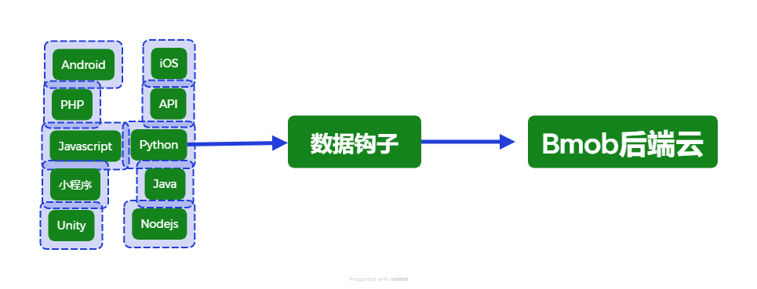
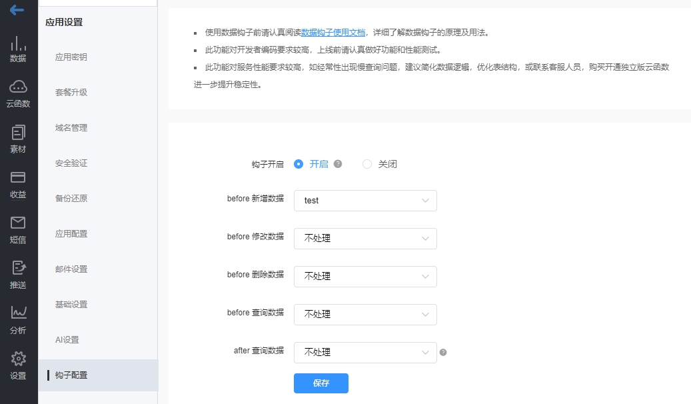

数据钩子是配合Bmob云函数使用的一个强大的模块，所有的数据请求都会先经过数据钩子，再和Bmob后端云进行交互，系统架构如下：



由此可见，数据钩子可以帮我们实现包含但不限于如下场景：

- 限制或者允许某些表的增加、更新、删除或者查询。
    
- 限制或者允许某个平台（Android、iOS或者API）的访问。
  
- 对客户端上传的数据进行二次校验和处理。
  
- 对查询的数据进行二次处理。
  


## 开启和设置数据钩子


在 `应用` -> `设置` -> `钩子配置` 中开启钩子和设置对应的云函数，如下图所示。



上面的例子中，针对这个应用的所有新增数据的请求，都会先转到 `test` 这个云函数先进行处理。

这里需要注意的是，**<font color="red">钩子服务是针对所有表的处理</font>**，如果你设置了钩子，建议一定要加上对表名的判定，以免造成错误。

## 限制或者允许某些表的增删改查

如果我们要设置限制对 `Order` 订单表的数据请求，可以编写云函数如下：

```java

function onRequest(request, response, modules) {

    let tableName = request.body.table;
    if(tableName=="Order") {
      response.send({"msg": tableName + "表禁止操作"});
    }
    else{
      response.send({"msg": "ok"});
    }
}

```

其中，`request.body.table`是Bmob收到前端请求后，自动给云函数转发过来的标记，表示`请求的表名`。

`response.end({"msg":"ok"})` 表示告诉数据钩子，这个请求还要按原来的需求，继续下一步的操作。如果`msg`返回的内容不是`ok`，则不再请求Bmob后端云，直接返回客户端。

除了`table`标记之外，Bmob收到前端请求后，会自动给 `request.body` 添加如下标记：

- `request.body.caller` ：表示请求的客户端，值分别为：Android、IOS或者空。
    
- `request.body.ua` ：表示请求的user_agent信息。
  
- `request.body.token` ：表示请求的登录用户的sessionToken信息。
  
- `request.body.operation` ：表示请求类型，值分别是：`create`、`update`、`delete`、`query`。


## 限制或者允许某个平台（Android、iOS或者API）的访问

如果我们要限制IOS平台的访问，可以编写云函数如下：

```java

function onRequest(request, response, modules) {
    // 获取请求平台
    let caller = request.body.caller;
    if(caller=="IOS")){
      response.send({"msg":"禁止IOS访问"});
    }
    else{
      response.send({"msg":"ok"});
}

```


## 对客户端上传的数据进行二次校验和处理

假如我们要对客户端上传上来的 `sex` 字段进行判定，如果值为 `男` 的话，设置 `sex` 字段为 `1` ，否则设置为 `0` ，可以编写云函数如下：

```java

function onRequest(request, response, modules) {

    let data = JSON.parse(request.body.data);
    data["$set"]["sex"] = dm["$set"]["sexText"] == "男" ? 1 : 0;

    let backData = {
        "success": "ok",
        "data": JSON.stringify(data)
    };

    response.end(backData);
}

```