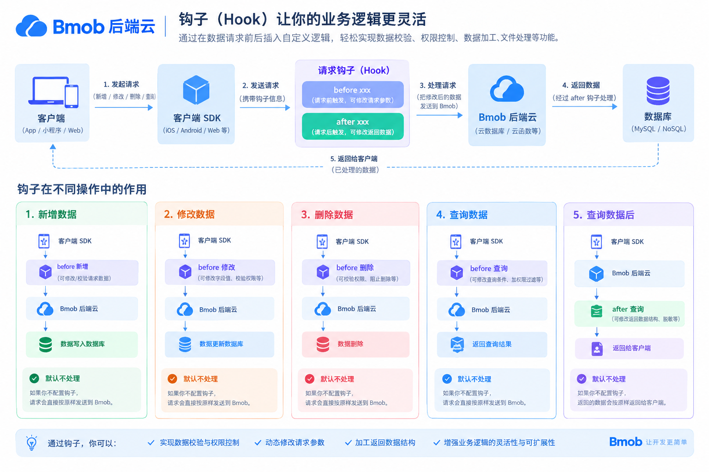
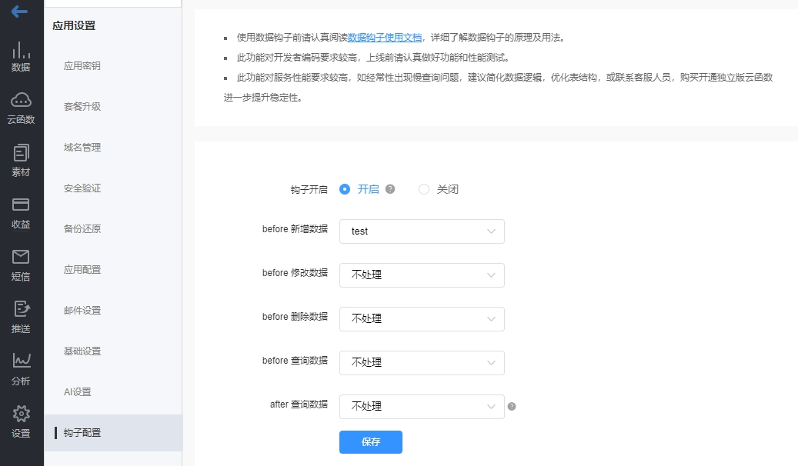

数据钩子是配合Bmob云函数使用的一个强大的模块，所有的数据请求都会先经过数据钩子，再和Bmob后端云进行交互，系统架构如下：




由此可见，数据钩子可以帮我们实现包含但不限于如下场景：

- 限制或者允许某些表的增加、更新、删除或者查询。
  
- 限制或者允许某个平台（Android、iOS或者API）的访问。
  
- 对客户端上传的数据进行二次校验和处理。
  
- 对查询的数据进行二次处理。
  


## 开启和设置数据钩子


在 `应用` -> `设置` -> `钩子配置` 中开启钩子和设置对应的云函数，如下图所示。



上面的例子中，针对这个应用的所有新增数据的请求，都会先转到 `test` 这个云函数先进行处理。

这里需要注意的是，**<font color="red">钩子服务是针对所有表的处理</font>**，如果你设置了钩子，建议一定要加上对表名的判定，以免造成错误。

## 限制或者允许某些表的增删改查

如果我们要设置限制对 `Order` 订单表的数据请求，可以编写云函数如下：

```javascript
function onRequest(request, response, modules) {
    // 钩子对所有表生效，务必先判定表名，避免误伤其他表
    let tableName = request.body.table;

    if (tableName == "Order") {
        // msg 返回的内容不是 "ok" 时，不再请求 Bmob 后端云，直接返回客户端
        response.send({ "msg": tableName + "表禁止操作" });
    } else {
        // msg 为 "ok" 时，按原请求继续下一步操作
        response.send({ "msg": "ok" });
    }
}
```

其中，`request.body.table`是Bmob收到前端请求后，自动给云函数转发过来的标记，表示`请求的表名`。

`response.end({"msg":"ok"})` 表示告诉数据钩子，这个请求还要按原来的需求，继续下一步的操作。如果`msg`返回的内容不是`ok`，则不再请求Bmob后端云，直接返回客户端。

除了`table`标记之外，Bmob收到前端请求后，会自动给 `request.body` 添加如下标记：

- `request.body.caller` ：表示请求的客户端，值分别为：Android、IOS或者空。
  
- `request.body.ua` ：表示请求的user_agent信息。
  
- `request.body.token` ：表示请求的登录用户的sessionToken信息。
  
- `request.body.operation` ：表示请求类型，值分别是：`create`、`update`、`delete`、`query`。


## 限制或者允许某个平台（Android、iOS或者API）的访问

如果我们要限制IOS平台的访问，可以编写云函数如下：

```javascript
function onRequest(request, response, modules) {
    // 获取请求平台：Android、IOS 或者空
    let caller = request.body.caller;

    if (caller == "IOS") {
        response.send({ "msg": "禁止IOS访问" });
    } else {
        response.send({ "msg": "ok" });
    }
}
```


## 对客户端上传的数据进行二次校验和处理

假如我们要对客户端上传上来的 `sex` 字段进行判定，如果值为 `男` 的话，设置 `sex` 字段为 `1` ，否则设置为 `0` ，可以编写云函数如下：

```javascript
function onRequest(request, response, modules) {
    // 1. 钩子对所有表生效，务必先判定表名，避免误伤其他表
    let tableName = request.body.table;
    if (tableName != "Order") {
        // 其他表：原样放行，继续走正常的请求流程
        response.send({ "msg": "ok" });
        return;
    }

    // 2. 客户端上传的数据在 request.body.data 中，是一个 JSON 字符串
    //    update 操作的结构形如：{ "$set": { 字段: 值 }, "objectId": "xxx" }
    let data = JSON.parse(request.body.data || "{}");

    // 3. 二次校验与处理：将 sexText 字段的值转为数值字段 sex
    data["$set"]["sex"] = data["$set"]["sexText"] == "男" ? 1 : 0;
    // 处理完成后，可以删除不再需要的字段，例如：
    // delete data["$set"]["sexText"];

    // 4. 返回修改后的数据
    //    - success 为 "ok"：告诉数据钩子继续执行原请求
    //    - data：修改后的数据（JSON 字符串），会替换客户端上传的数据提交给后端
    let backData = {
        "success": "ok",
        "data": JSON.stringify(data)
    };
    response.end(backData);
}
```

这里需要区分钩子的两种返回方式：

- **放行/拦截**：`response.send({ "msg": "ok" })` 表示放行，`msg` 为其他内容时表示拦截，直接返回客户端，不再请求 Bmob 后端云。
- **修改数据后放行**：`response.end({ "success": "ok", "data": JSON.stringify(修改后的数据) })`，其中 `success` 为 `"ok"` 表示继续执行，`data` 为修改后的数据（必须是 JSON 字符串），会替换客户端上传的数据。

## 对查询的数据进行二次处理

数据钩子同样会拦截查询（`request.body.operation` 为 `query`）请求。我们可以根据 `request.body.table` 和 `request.body.operation` 决定是否放行查询，也可以在钩子中通过 `modules.oData` 主动查询数据库，对数据做关联校验、统计等二次处理。

### 禁止某些表的查询

例如：禁止 `Order` 表的查询请求，其他操作一律放行。

```javascript
function onRequest(request, response, modules) {
    // 获取请求的表名与操作类型：create、update、delete、query
    let tableName = request.body.table;
    let operation = request.body.operation;

    if (tableName == "Order" && operation == "query") {
        // 拦截 Order 表的查询
        response.send({ "msg": "Order 表禁止查询" });
    } else {
        // 其他表或其他操作：原样放行
        response.send({ "msg": "ok" });
    }
}
```

### 查询前钩子（修改查询条件）

查询请求被钩子拦截时，`request.body.data` 是客户端查询条件序列化后的 JSON 字符串（包含 `where`、`limit`、`skip`、`order`、`include`、`keys` 等字段）。我们可以在钩子中解析它、改写 `where` 条件，再把新的查询条件回传给 Bmob 后端云，实现"查询前钩子"的效果，例如：只能查到自己（或自己所在团队）的数据、自动追加 `status = 1` 之类的软删除条件等。

```javascript
function onRequest(request, response, modules) {
    // 1. 先判定表名，避免误伤其他表
    let tableName = request.body.table;

    if (tableName == "Order") {
        // 2. request.body.data 是查询条件 JSON 字符串（客户端 Query 序列化后的结果）
        let query = {};
        try {
            query = JSON.parse(request.body.data || "{}");
        } catch (e) {
            query = {};
        }

        // 3. 追加/改写 where 条件：只允许查询 status 为 1 的订单
        if (!query.where) {
            query.where = {};
        }
        query.where.status = 1;

        // 4. 返回修改后的查询条件，继续按原请求查询
        //    - msg 为 "ok"：告诉数据钩子继续执行原请求
        //    - data：修改后的查询条件（JSON 字符串），会替换客户端上传的查询条件
        response.send({
            "msg": "ok",
            "data": JSON.stringify(query)
        });
        return;
    }

    // 其他表放行
    response.send({ "msg": "ok" });
}
```

> **说明**：
> - 如果不想改写条件，只是拦截查询，直接 `response.send({ "msg": "xxx表禁止查询" })` 即可（`msg` 不是 `"ok"` 时不再请求后端云）。
> - 查询条件中的 `where` 支持 Bmob 的查询语法，例如 `query.where.createdAt = { "$gte": { "__type": "Date", "iso": "2026-01-01T00:00:00.000Z" } }`。
> - 返回时 `data` 必须是 **JSON 字符串**，否则后端云无法解析。
> - 如果需要在钩子中先查库做权限/关联校验（例如校验当前 `token` 对应的用户），请使用 `modules.oData`，并在其回调中再 `response.send`（见下一小节）。

### 在数据钩子中查询数据库

数据钩子中可以通过 `modules.oData` 查询数据库。例如：在 `Order` 表新增订单时，先查询 `User` 表校验用户是否存在，并统计当前订单总数，再把查询结果写入本次新增的数据中。

```javascript
function onRequest(request, response, modules) {
    let tableName = request.body.table;
    let operation = request.body.operation;

    // 只处理 Order 表的新增请求，其他请求一律放行
    if (tableName != "Order" || operation != "create") {
        response.send({ "msg": "ok" });
        return;
    }

    let db = modules.oData;                    // 数据库操作模块
    let orderData = JSON.parse(request.body.data || "{}"); // 新增的数据是字段对象，如 { "userId": "xxx" }

    // 1. 查询订单所属的用户是否存在
    //    注意：findOne 不能直接操作 _User 表，查询用户请使用 getUserByObjectId
    db.findOne({
        "table": "User",
        "objectId": orderData.userId
    }, function(err, user) {
        if (err) {
            // 用户不存在：拦截本次下单，把错误信息直接返回客户端
            response.send({ "msg": "下单失败：" + err.error });
            return;
        }

        // 2. 统计当前订单总数（count 设为 1 且 limit 为 0 时，只返回总数不返回数据）
        db.find({
            "table": "Order",
            "limit": 0,
            "count": 1
        }, function(err, countData) {
            if (err) {
                response.send({ "msg": "统计订单失败：" + err.error });
                return;
            }

            // oData 回调返回的 data 都是字符串，必须 JSON.parse 后才能当对象使用
            let userObj = JSON.parse(user);
            let orderCount = JSON.parse(countData).count;

            // 3. 把查询结果附加到本次新增的数据中
            orderData.userName = userObj.username;
            orderData.orderCount = orderCount;

            // 4. 返回修改后的数据，继续执行原请求
            response.end({
                "success": "ok",
                "data": JSON.stringify(orderData)
            });
        });
    });
}
```

> **注意**：
> - `modules.oData` 所有回调返回的 `data` 都是字符串类型，需要 `JSON.parse` 后才能按对象使用。
> - 回调出错时，`err` 对象包含 `err.error`（错误信息）和 `err.code`（错误码）两个属性。
> - 数据钩子基于 Node.js，所有数据库操作都是异步回调风格，必须在回调内完成后续逻辑，不要在主函数体内直接 `response.send`。