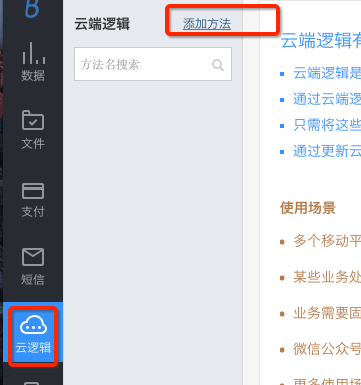

# 云函数开发快速入门

Bmob的云函数是一个非常强大的模块，提供了云端代码的直接编写、数据钩子、定时任务等子模块，可以实现定时计算游戏的排行榜、拦截非法请求、处理复杂逻辑、动态调整等功能。

## 创建云函数

在Bmob后台中，进入应用，依次点击“云函数->添加方法”，在弹出窗口中输入云函数的方法名。如下图所示：

注意：`方法名会在SDK调用时使用到`。




接着，你就可以在云函数的编辑器中撰写云函数了。

云函数支持`NodeJs`语言，编写非常简单，你只需要在`onRequest`方法中编写你的业务逻辑代码就可以了。

`onRequest`方法包含3个参数，分别是：
- `request`（请求对象，可以从中获取SDK上传的参数）
- `response`（回应对象，可以将云函数的执行结果返回到SDK中）,
- `modules`（可调用的模块，包含数据库对象、HTTP对象等）。
  
为方便演示，这里简单实现一个功能：接收客户端传上来的`name`参数，根据`name`的值返回不同的结果。示例代码如下：

```java
function onRequest(request, response, modules) {
  //获取SDK客户端上传的name参数
  var name = request.body.name;
    if(name == 'bmob')
      response.end('欢迎使用Bmob');
    else
      response.end('输入错误，请重新输入');
}
```

其中，`request.body`会携带客户端上传上来的参数列表。

## 云函数的调用

以下提供Android和iOS平台调用云函数的示例代码，更多语言请查看我们的开发文档。

### Android调用云函数

```java
//test对应你刚刚创建的云函数方法名
String cloudCodeName = "test";
JSONObject params = new JSONObject();
//name是上传到云端的参数名称，值是bmob，云函数可以通过调用request.body.name获取这个值
params.put("name", "bmob");
//创建云函数对象
AsyncCustomEndpoints cloudCode = new AsyncCustomEndpoints();
//异步调用云函数
cloudCode.callEndpoint(MainActivity.this, cloudCodeName, params, new CloudCodeListener() {

    //执行成功时调用，返回result对象
    @Override
    public void onSuccess(Object result) {
        Log.i("bmob", "result = "+result.toString());
    }

    //执行失败时调用
    @Override
    public void onFailure(String err) {
        Log.i("bmob", "BmobException = "+err);
    }
});
```

### iOS调用云函数

```java
	//name是上传到云端的参数名称，值是bmob，云函数可以通过调用request.body.name获取这个值
    NSDictionary  *dic = [NSDictionary  dictionaryWithObject:@"bmob" forKey:@"name"];
    //test对应你刚刚创建的云函数名称
    [BmobCloud callFunctionInBackground:@"test" withParameters:dic block:^(id object, NSError *error) {

    if (!error) {
     	//执行成功时调用
    	NSLog(@"error %@",[object description]);
    }else{
       //执行失败时调用
    	NSLog(@"error %@",[error description]);
    }

    }] ;
```


