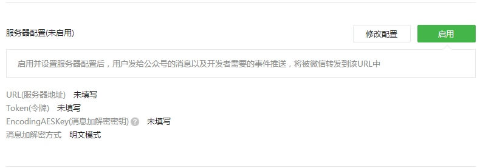
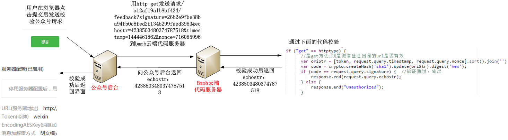
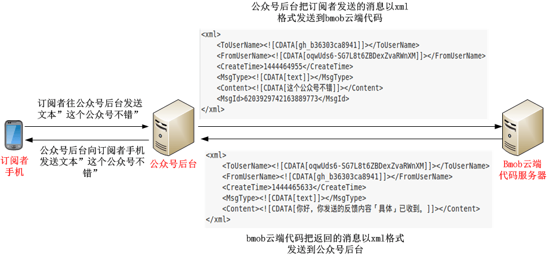

## 简介

本教程将引导你完成如下的微信公众号开发任务，实现一个反馈意见收集的功能：

- 把订阅者发送到公众号后台的反馈意见存储在在Bmob中的 `message` 表。
- 收到反馈意见后，公众号自动给订阅者发送消息，表示消息已收到。

## 创建云函数

创建一个名为"feedback"的云函数用于实现上面的功能，代码如下：

```
function onRequest(request, response, modules) {
    var token = "weixin";         //这里的值必须与在微信公众号后台填入的token值一致
    var crypto = modules.oCrypto; //使用加解密模块
    var httptype = modules.oHttptype;　//获取调用云函数的是post或者get方式
    var xml2js = modules.oXml2js;　//实现xml和js格式之间的相互转换
    var db = modules.oData;         //数据库对象
    if ("get" == httptype) {
        　//是get方法,则是微信验证回调的url是否有效
          var oriStr = [token, request.query.timestamp, request.query.nonce].sort().join('')
          var code = crypto.createHash('sha1').update(oriStr).digest('hex');
          if (code == request.query.signature) {　//验证通过，输出
              response.end(request.query.echostr);
          } else {
              response.end("Unauthorized");
          }
    } else {
           //是post,接收定阅者发送过来的消息后返回，把反馈意见存储表“message”中。
            db.insert({
              "table":"message",             //表名
              "data":{"userId":request.body.xml.FromUserName,"content":request.body.xml.Content}
            },function(err,data){
              //构造公众号后台所需要的xml格式，并返回给公众号后台
               var result = {
                    xml: {
                      ToUserName: request.body.xml.FromUserName,
                      FromUserName: request.body.xml.ToUserName ,
                      CreateTime: new Date().getTime(),
                      MsgType: 'text',
                      Content: '你好，你发送的反馈内容「' + request.body.xml.Content + '」已收到。'
                    }
                }
                var builder = new xml2js.Builder();
                var xml = builder.buildObject(result); //利用模块xml2js，把json对象转换为一个xml文本
                response.set('Content-Type', 'text/xml'); //设置返回的http header
                response.end(xml);
            });


    }
}

```

这个云函数的内容暂时看不懂没关系，下面会逐渐解释其中的含义。

## 启用微信公众号的开发模式

只有启用微信公众号的开发模式后，才能把订阅者发送到微信公众号后台的消息发送到bmob云函数中进行处理。

微信公众平台地址：[https://mp.weixin.qq.com ](https://mp.weixin.qq.com  "https://mp.weixin.qq.com ")

登录微信公众平台后台，在左侧列表中最下方，找到“开发者中心”，点击进入，如图19所示：


进入服云函数务器配置填写框，如图20所示：



点击“修改配置”按钮，如图21所示：


此处的URL（http://cloudweixinopen.bmobapp.com/a12af19a1b8bf434/feedback）为上节中生成的云函数“feedback”的调用，按照云函数的调用规格，a12af19a1b8bf434为该应用的Secret Key，标明调用的是哪个应用，feedback为云函数的名称。Token定义为weixin。EncodingAESKey则不用填，点击“随机生成”让自动生成一个，消息加解密方式选择“明文模式”，然后点击“提交”按钮，如图22所示：


在弹出框中点击确定，如图24所示：


成功启用后如图25所示：


恭喜，你成功启用开发模式。

用户往该公众号发送消息后，用户收到的反馈内容如图27所示：


查看应用的后台，可看到接收的消息已存储在表message中，如图28所示：


## 数据收发原理及消息数据格式

云函数开发微信公众号有两个重要原理一定要弄明白：

- 变为开发模式时，微信公众号后台往配置的url发送校验请求，这个过程云函数校验信息的原理。
- 云函数收发微信公众号后台传递过来的消息的原理。

### 变为开发模式时的消息校验原理

在开发者首次提交验证申请时，微信公众号后台将发送GET请求到填写的URL上，并且带上四个参数（signature、timestamp、nonce、echostr），开发者通过对签名（signature）的效验来判断此条消息的真实性。

这4个参数的含义如下：

- signature：微信加密签名，signature结合了开发者填写的token参数和请求中的timestamp参数、nonce参数。
- timestamp：时间戳。
- nonce：随机数
- echostr：随机字符串

此后，每次开发者接收用户消息的时候，微信公众号后台也都会带上前面三个参数（signature、timestamp、nonce）访问开发者设置的URL，开发者依然通过对签名的效验判断此条消息的真实性。效验方式与首次提交验证申请一致。

开发者通过检验signature对请求进行校验（下面有校验方式）。若确认此次GET请求来自微信公众号后台，请原样返回echostr参数内容，则接入生效，成为开发者成功，否则接入失败。

消息校验流程如下：

1. 将token、timestamp、nonce三个参数进行字典序排序。
2. 将三个参数字符串拼接成一个字符串进行sha1加密。
3. 开发者获得加密后的字符串可与signature对比，标识该请求来源于微信。

整个流程如图26所示：



使用的云函数如下：

```
        　//是get方法,则是微信验证回调的url是否有效
          var oriStr = [token, request.query.timestamp, request.query.nonce].sort().join('')
          var code = crypto.createHash('sha1').update(oriStr).digest('hex');
          if (code == request.query.signature) {　//验证通过，输出
              response.end(request.query.echostr);
          } else {
              response.end("Unauthorized");
          }
```

其中token的值是在微信公众号后台填入的token值：“weixin”。

在这个校验流程的云函数中，使用oCrypto这个云函数的加密对象模块，提供md5和sha1两种加密算法。通过这个模块，按照微信校验的流程完成校验。oCrypto更多的功能详细参考：https://www.npmjs.org/package/crypto

另外，云函数使用了oHttptype模块获取当前的http调用方式。因为微信公众平台调用云函数有两种方式：

- get方式，用于检验。
- post方式，用于转发订阅者往公众平台发送的消息。

通过oHttptype模块得知是用采用get方式调用云函数，运行校验的代码并返回echostr参数。

### 云函数收发微信公众号后台传递过来的消息的原理
在上一节的演示中，订阅者往该公众号发送消息后，返回已收到反馈内容的消息。

这一原理的消息流程如图29所示：



云函数内部通过下面的代码处理用户发送的消息：
```
 		   //是post,接收定阅者发送过来的消息后返回，把反馈意见存储表“message”中。
            db.insert({
              "table":"message",             //表名
              "data":{"userId":request.body.xml.FromUserName,"content":request.body.xml.Content}
            },function(err,data){
              //构造公众号后台所需要的xml格式，并返回给公众号后台
               var result = {
                    xml: {
                      ToUserName: request.body.xml.FromUserName,
                      FromUserName: request.body.xml.ToUserName ,
                      CreateTime: new Date().getTime(),
                      MsgType: 'text',
                      Content: '你好，你发送的反馈内容「' + request.body.xml.Content + '」已收到。'
                    }
                }
                var builder = new xml2js.Builder();
                var xml = builder.buildObject(result); //利用模块xml2js，把json对象转换为一个xml文本
                response.set('Content-Type', 'text/xml'); //设置返回的http header
                response.end(xml);
            });
```


从上图可以看出，用户在发送一个文本后，微信公众号后台将组装一个xml消息发送给云函数服务器。当云函数接收到http头部Content-Type为text/xml的请求后，云函数自动把xml消息转换为一个对象放在request.body.xml中，通过获取request.body.xml对应的属性就能获取xml节点的值。

云函数解析xml对象，根据节点信息，把发送者(request.body.xml.FromUserName)和消息内容（request.body.xml.Content）存储在表“message”后，然后通过一定的规则组装成一个xml文本回复给微信公众号后台，微信公众号后台再回复给用户。在这个收发过程中，发送方和接收方进行了调换(ToUserName和FromUserName值互换)，收发都是以xml格式在后台进行传输的。所以掌握各种消息类型的接收回复是进行微信公众平台开发的基础！

最常见的消息类型为文本的xml格式如下：

```
<xml>
<ToUserName><![CDATA[gh_b36303ca8941]]></ToUserName>
<FromUserName><![CDATA[oqwUds6-SG7L8t6ZBDexZvaRWnXM]]></FromUserName>
<CreateTime>1444464955</CreateTime>
<MsgType><![CDATA[text]]></MsgType>
<Content><![CDATA[这个公众号不错]]></Content>
<MsgId>6203929742163889773</MsgId>
</xml>
```

XML格式讲解：

- ToUserName 消息接收方微信号，一般为公众平台账号微信号
- FromUserName 消息发送方微信号
- CreateTime 消息创建时间
- MsgType 消息类型；文本消息为text
- Content 消息内容
- MsgId 消息ID号

各种类型的消息详解，请查看微信开发文档：[https://developers.weixin.qq.com/doc/offiaccount/Getting_Started/Overview.html](https://developers.weixin.qq.com/doc/offiaccount/Getting_Started/Overview.html "公众号的各种消息类型")

## 总结

通过本教程，你得到了以下收获：

- 了解bmob应用和云函数的功能。
- 在不需要搭建服务器，不需要懂得基本的运维知识下，使用bmob云函数在30分钟内实现微信公众平台的开发，完了消息存储和消息自动回复这两个功能。

阅读本教程后，想了解云后端服务bmob可以实现哪些更酷的功能吗？点击[http://www.bmobapp.com](http://www.bmobapp.com "这里")，立刻进入bmob了解更多。


