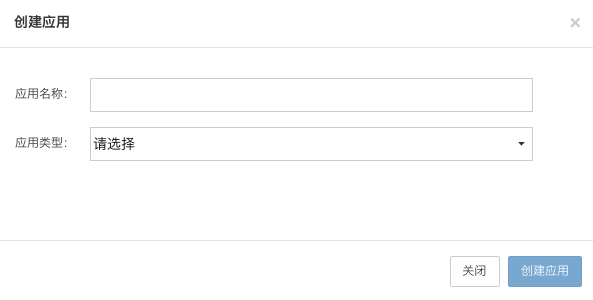
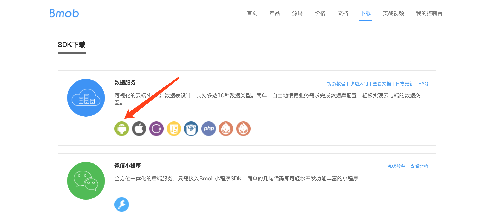
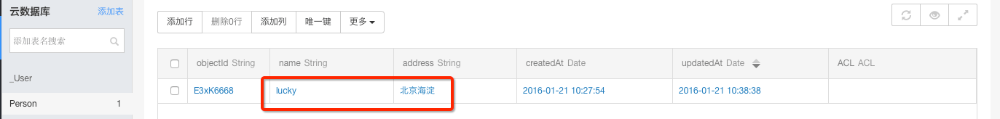

## 注册Bmob帐号

在网址栏输入www.bmobapp.com或者在百度输入Bmob进行搜索，打开Bmob官网后，点击右上角的“注册”，在跳转页面填入你的姓名、邮箱、设置密码，确认后到你的邮箱激活Bmob账户，你就可以用Bmob轻松开发应用了。


## 网站后台创建应用

登录账号进入bmob后台后，点击后台界面左上角“创建应用”，在弹出框输入你应用的名称，然后确认，你就拥有了一个等待开发的应用。



## 获取应用密钥和下载SDK

选择你要开发的应用，进入该应用


在跳转页面，进入设置/应用密钥，点击复制，即可得到Application ID


获取Application ID后，下载SDK（下载地址：[http://www.bmobapp.com/site/sdk#android_sdk](http://www.bmobapp.com/site/sdk#android_sdk)）。



## SDK导入

### AndroidStudio配置

### 导入依赖

在`app`的`build.gradle`文件中添加`依赖文件`：
```gradle
dependencies {
	implementation 'io.github.bmob:android-sdk:3.8.22'
	implementation 'io.reactivex.rxjava2:rxjava:2.2.8'
	implementation 'io.reactivex.rxjava2:rxandroid:2.1.1'
	implementation 'com.squareup.okhttp3:okhttp:4.8.1'
	implementation 'com.squareup.okio:okio:2.2.2'
	implementation 'com.google.code.gson:gson:2.8.5'
}
```

## 配置AndroidManifest.xml

在你的应用程序的`AndroidManifest.xml`文件中添加如下的`权限`和`ContentProvider`信息：


```xml
<?xml version="1.0" encoding="utf-8"?>
    <manifest xmlns:android="http://schemas.android.com/apk/res/android"
    	package="cn.bmob.example"
    	android:versionCode="1"
    	android:versionName="1.0">

    <uses-sdk android:minSdkVersion="8" android:targetSdkVersion="17"/>

	<!--允许联网 -->
	<uses-permission android:name="android.permission.INTERNET" />
	<!--获取GSM（2g）、WCDMA（联通3g）等网络状态的信息  -->
	<uses-permission android:name="android.permission.ACCESS_NETWORK_STATE" />
	<!--获取wifi网络状态的信息 -->
	<uses-permission android:name="android.permission.ACCESS_WIFI_STATE" />
	<!--获取sd卡写的权限，用于文件上传和下载-->
	<uses-permission android:name="android.permission.WRITE_EXTERNAL_STORAGE" />
	<!--允许读取手机状态 用于创建BmobInstallation-->
	<uses-permission android:name="android.permission.READ_PHONE_STATE" />

    <application
        android:allowBackup="true"
        android:icon="@drawable/ic_launcher"
        android:label="@string/app_name"
        android:theme="@style/AppTheme">
        <activity
            android:name="cn.bmob.example.MainActivity"
            android:screenOrientation="portrait"
            android:label="@string/app_name" >

                <action android:name="android.intent.action.MAIN"/>
                <category android:name="android.intent.category.LAUNCHER"/>
		</activity>

		<!--添加ContentProvider信息 -->
		<provider
			android:name="cn.bmob.v3.util.BmobContentProvider"
			android:authorities="你的应用包名.BmobContentProvider">
		</provider>
    </application>
</manifest>
```

## 初始化BmobSDK

在你应用程序启动的Application的onCreate()方法中初始化Bmob功能。代码如下所示：

```java
		Bmob.initialize(this, "Your Application ID");
```

## 添加一行数据

首先创建JavaBean（对应为Bmob后台的数据表，更详细的解释请[查看Android开发文档](http://doc.bmobapp.com/data/android/develop_doc/index.html)）

```java
public class Person extends BmobObject {
	private String name;
	private String address;

	public String getName() {
		return name;
	}
	public void setName(String name) {
		this.name = name;
	}
	public String getAddress() {
		return address;
	}
	public void setAddress(String address) {
		this.address = address;
	}
}
```

添加数据

```java
Person p2 = new Person();
p2.setName("lucky");
p2.setAddress("北京海淀");
p2.save(new SaveListener<String>() {
	@Override
	public void done(String objectId,BmobException e) {
		if(e==null){
			//toast("添加数据成功，返回objectId为："+objectId);
		}else{
			//toast("创建数据失败：" + e.getMessage());
		}
	}
});
```

如果toast出添加数据成功的消息，你会在Bmob对应Application Id的数据表中看到有一行新增的数据，如下图所示：



## 获取一行数据

```java
//查找Person表里面id为6b6c11c537的数据
BmobQuery<Person> bmobQuery = new BmobQuery<Person>();
bmobQuery.getObject("6b6c11c537", new QueryListener<Person>() {
	@Override
	public void done(Person object,BmobException e) {
		if(e==null){
			//toast("查询成功");
		}else{
			//toast("查询失败：" + e.getMessage());
		}
	}
});
```

## 修改一行数据

```java
//更新Person表里面id为6b6c11c537的数据，address内容更新为“北京朝阳”
Person p2 = new Person();
p2.setAddress("北京朝阳");
p2.update("6b6c11c537", new UpdateListener() {

	@Override
	public void done(BmobException e) {
		if(e==null){
			//toast("更新成功:"+p2.getUpdatedAt());
		}else{
			//toast("更新失败：" + e.getMessage());
		}
	}

});
```

## 删除一行数据

```java
Person p2 = new Person();
p2.setObjectId("6b6c11c537");
p2.delete(new UpdateListener() {

	@Override
	public void done(BmobException e) {
		if(e==null){
			//toast("删除成功:"+p2.getUpdatedAt());
		}else{
			//toast("删除失败：" + e.getMessage());
		}
	}

});
```

## 源码下载

[快速入门相关源码下载](http://www.bmobapp.com/static/Bmob_android_quickstart.zip "快速入门相关源码下载")

案例教程和源码是快速入门的最简单方法，Bmob也为大家准备了相关的[案例教程和源码](http://doc.bmobapp.com/data/android/example/)，欢迎大家下载和查看。

为方便大家更好的理解Bmob SDK能够做的事情，我们还特意为大家提供了一些源码，大家可以下载之后，**嵌入Bmob的AppKey**，再打包运行。

**阅读源码是一种良好的习惯！！**

即时聊天案例源码：[https://github.com/bmob/BmobIMSDK4Android](https://github.com/bmob/BmobIMSDK4Android)

图文社区案例源码：[https://git.oschina.net/v7/Wonderful](https://git.oschina.net/v7/Wonderful)  这个案例是猿圈媛圈开发团队提供的。

校园小菜案例源码：[https://github.com/bmob/Shop](https://github.com/bmob/Shop) 这个案例是湖工大的朋友提供的。

社交分享案例源码：[https://github.com/bmob/bmob-android-social-share](https://github.com/bmob/bmob-android-social-share) 这个是金刚锁开发者提供的

第三方登录案例源码：[https://github.com/bmob/bmob-android-demo-thirdpartylogin](https://github.com/bmob/bmob-android-demo-thirdpartylogin)  包含第三方登录和登录后获取用户信息的源码

