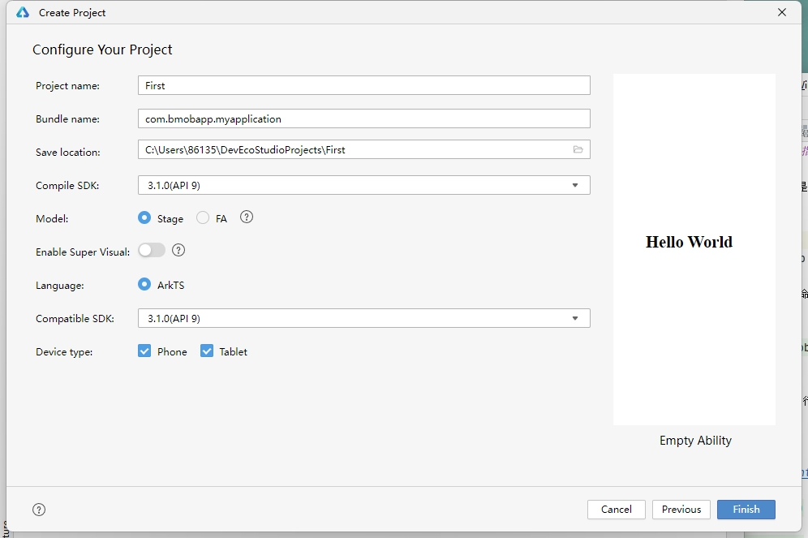
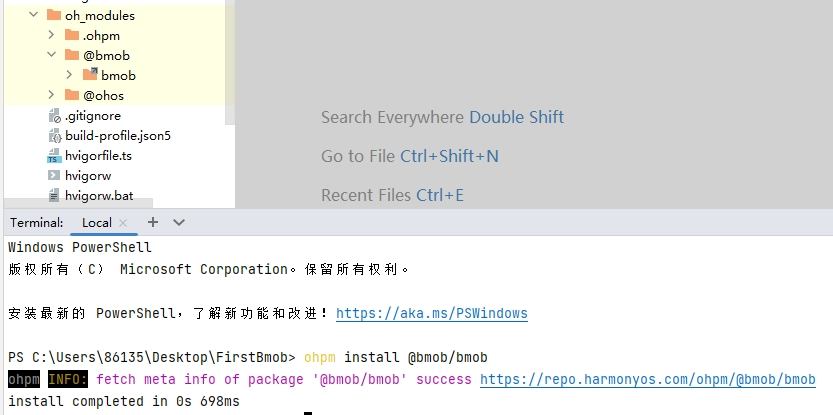
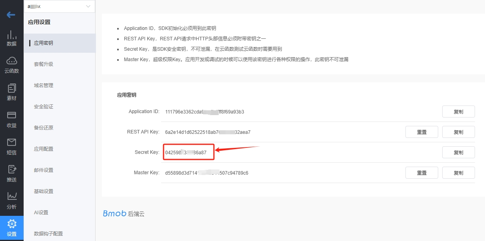
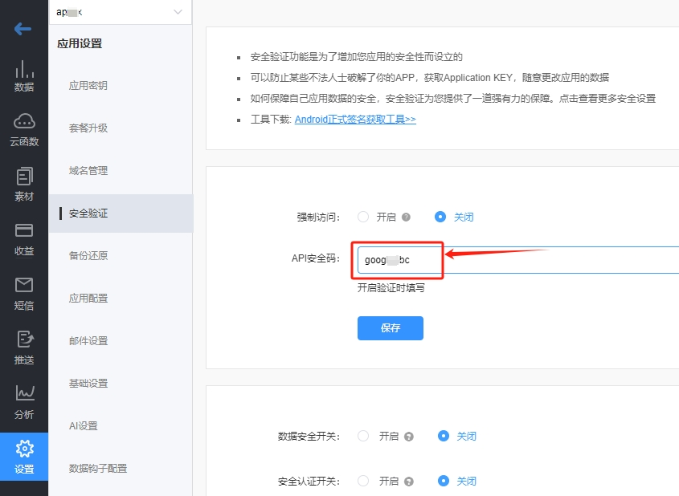
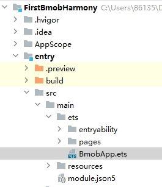
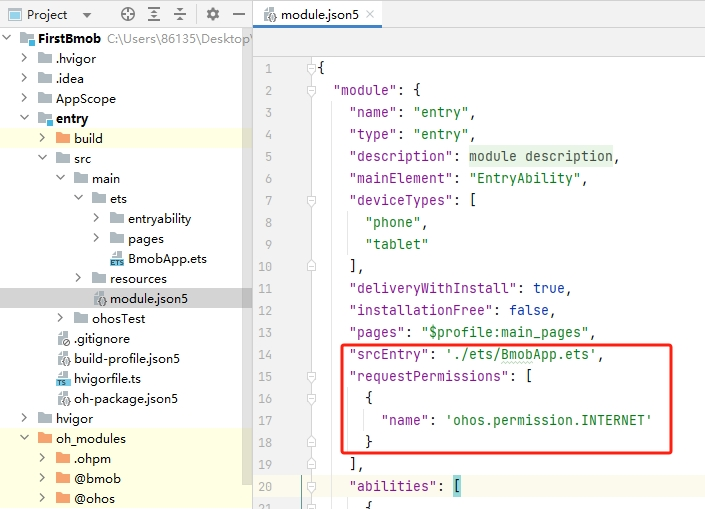
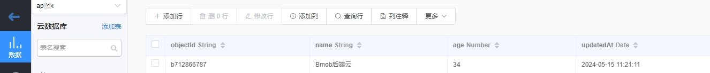
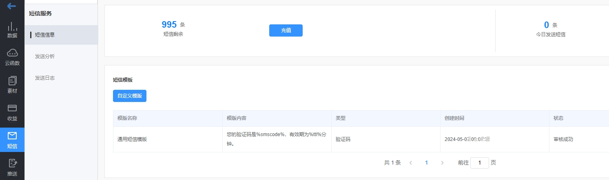

bmob harmony sdk是Bmob后端云专门为鸿蒙系统开发的原生SDK，完全采用ArkTS语言开发，支持云数据库、云函数、文件服务、短信服务等，帮助开发者专注前端交互，快速开发应用。

## 安装SDK

打开 DevEco Studio 开发工具，新建一个Project。Model选择Stage，开发语言选择ArkTS，如下图所示：。



在 DevEco Studio 开发工具的命令行（Terminal）中执行下面的命令，安装Bmob Harmony SDK：

```shell
ohpm install @bmob/bmob 
```

如果一切顺利，你会在当前项目下的`oh_modules`目录下看到`@bmob/bmob`的包已经成功下载，如下图所示：



如果执行命令时如果出现：`无法将“ohpm"项识别为 cmdlet、函数、脚本文件或可运行程序的名称。`的错误提示，请先将 `ohpm` 命令添加到path环境变量中再执行安装。

## 获取密钥

登录 [Bmob后端云](https://www.bmobapp.com) ，创建应用，获取Secret Key和Secret Code，如下图所示：





## 初始化应用

在你创建的鸿蒙应用中，`entry/src/main/ets` 下面新建一个ArkTS File，名为BmobApp。目录结构如下：



代码如下：

```javascript
import { Bmob } from '@bmob/bmob';
import AbilityStage from '@ohos.app.ability.AbilityStage';
export default class BmobApp extends AbilityStage {
    onCreate() {
        super.onCreate();
        Bmob.initialize('4cf1d10fc37b994c', '1ce87fa28df432a0')
    }
}
```

## 配置网络权限和设置应用入口

打开 entry/src/main/module.json5 文件，在module节点下面新增 `srcEntry` 和 `requestPermissions` 子节点，配置如下：

```json5

{
  "module": {
    "name": "entry",
    "type": "entry",
    "description": "$string:module_desc",
    "mainElement": "EntryAbility",
    "deviceTypes": [
      "phone",
      "tablet"
    ],
    "srcEntry": "./ets/BmobApp.ets",
    "requestPermissions": [
      {
        "name": "ohos.permission.INTERNET"
      }
    ],
    ...省略更多
  }
}

```



## 数据操作

现在，我们就可以在ArkUI里面有需要用到云服务的地方添加Bmob的交互代码了。

首先，在pages的头部添加引用代码：

```javascript
import {Bmob} from '@bmob/bmob'
```

### 添加数据

```javascript
        Button('添加数据')
          .onClick(()=>{
            let query = Bmob.Query('test');
            query.set('name', 'Bmob后端云');
            query.set('age', 34);
            query.save().then((res) => {
              if (res != undefined) {
                Prompt.showToast({ message: '添加成功，objectId=' + res.objectId });
              }
            }).catch((err) => {
              Prompt.showToast({ message: `添加失败，原因:${err.error} 错误码：${err.code}` });
            });
          })

```

其中，`test` 对应Bmob后端云中的数据表名称，`name`、`age` 是`test`这个表中的字段名称，执行 `Bmob.Query.save()` 方法，会将数据添加Bmob后端云中。
如果执行成功，将会返回这条记录在Bmob后端云中对应的唯一标记 `objectId` 信息，如下图所示：



如果执行不成功，会返回错误对象信息，错误对象信息包含`error`(错误原因)和`code`（错误码）。
错误码列表文档请参考官方文档：[https://doc.bmobapp.com/other/error_code/index.html](https://doc.bmobapp.com/other/error_code/index.html)

### 修改数据

```javascript

        Button('修改数据')
            .onClick(() => {
              let query = Bmob.Query('test');
              query.set('objectId', 'b712866787');
              query.set('name', 'Bmob后端云新增鸿蒙SDK');
              query.set('age', 30);
              query.save().then((res) => {
                Prompt.showToast({ message: '修改成功，updatedAt=' + res.updatedAt });
              }).catch((err) => {
                Prompt.showToast({ message: '修改失败，原因:' + err.error });
              });
            });

```

其中，`test`对应Bmob后端云中的数据表名称，`objectId`是我们要修改的那条数据的唯一标记，`name`、`age` 是`test`这个表中的字段名称，执行 `Bmob.Query.save()` 方法，会将数据修改Bmob后端云中。
如果执行成功，将会返回这条记录的更新时间`updatedAt`.

### 删除数据

```javascript
        Button('删除数据')
            .onClick(() => {
              let query = Bmob.Query('test');
              query.destroy('d070b6b8fa').then((res) => {
                Prompt.showToast({ message: '删除成功' });
              }).catch((err) => {
                Prompt.showToast({ message: '删除失败，原因:' + err.error });
              });
            });
```

其中，`test`对应Bmob后端云中的数据表名称，`objectId`是我们要删除的那条数据的唯一标记，执行 `Bmob.Query.destroy()` 方法，会将数据从Bmob后端云中删除。
如果执行成功，将会返回`boolean`值，表示数据是否删除成功。

### 获取指定的一条数据

```javascript

        Button('获取指定的一条数据')
            .onClick(() => {
              let query = Bmob.Query('test');
              query.get('d9a7bd816e').then((res) => {
                Prompt.showToast({ message: res.name });
              }).catch((err) => {
                Prompt.showToast({ message: '获取失败，原因:' + err.error });
              });
            });
```

其中，`test`对应Bmob后端云中的数据表名称，`Bmob.Query.get()` 方法需要指定这条数据的唯一标识`objectId`(这里是d9a7bd816e)作为这个方法的唯一参数。
如果执行成功，将会返回这条数据的对象值。

### 查询多条数据

```javascript

        Button('获取多条数据')
            .onClick(() => {
              let query = Bmob.Query('test');
              query.find().then((res) => {
                res.forEach((result: any) => {
                  console.log('返回数据 name=' + result.name);
                });
              }).catch((err) => {
                Prompt.showToast({ message: '获取失败，原因:' + err.error });
              });
            });

```

其中，`test`对应Bmob后端云中的数据表名称，执行`Bmob.Query.find()` 方法，我们可以获取test表中前`100`条最新的数据。
如果执行成功，将会返回这些数据的对象列表信息，我们可以用`forEach`方法进行遍历。

### 条件查询

很多时候，我们需要对数据进行筛查，这就需要用到 `Bmob.Query.where` 的条件查询的方法，指定条件查询。如下面的代码表示要从test表中获取age大于20，而且小于40的所有数据。

```javascript

        Button('条件查询')
            .onClick(() => {
              let query = Bmob.Query('test');
              query.where(AND(GT('age', 20), LT('age', 40)))
                .find()
                .then((res) => {
                  res.forEach((result: any) => {
                    console.log('返回数据 age=' + result.age);
                  });
                })
                .catch((err) => {
                  Prompt.showToast({ message: '查询失败，原因:' + err.error });
                });
            });
```

bmob harmony sdk支持的条件查询方法如下：

| 方法   | 说明      |
|------|---------|
| AND  | 而且      |
| OR   | 或者      |
| GT   | 大于      |
| GTE  | 大于等于    |
| LT   | 小于      |
| LTE  | 小于等于    |
| LIKE | 模糊查询    |
| NE   | 不等于     |
| IN   | 包含在数组中  |
| NIN  | 不包含在数组中 |

### 分页查询

直接使用`Bmob.Query`的`find`方法最多只能一次返回100条数据，那如果表中的数据超过100条，我们应该如何获取呢？这就需要用到分页查询了。代码如下：

```javascript

        Button('分页查询')
            .onClick(() => {
              let query = Bmob.Query('test');
              query.where(AND(GT('age', 20), LT('age', 40)))
                .skip(10)
                .limit(50)
                .find()
                .then((res) => {
                  res.forEach((result: any) => {
                    console.log('返回数据 age=' + result.age);
                  });
                })
                .catch((err) => {
                  Prompt.showToast({ message: '查询失败，原因:' + err.error });
                });
            });
```

其中，`skip`方法表示跳过前面的10条数据，`limit`方法表示这次最多返回50条数据。

### 只选择某些列返回查询

有时候，我们不需要返回所有的列给客户端，这样可以节省流量，提高速度。

这就需要用到`Bmob.Query`的`select`方法，比如，我们只需要`test`表中的`age`和`name`字段，就可以用下面的代码：

```javascript

        Button('只选择某些列返回查询')
            .onClick(() => {
              let query = Bmob.Query('test');
              query.where(AND(GT('age', 20), LT('age', 40)))
                .select('age,name')
                .find()
                .then((res) => {
                  res.forEach((result: any) => {
                    console.log('返回数据 age=' + result.age);
                  });
                })
                .catch((err) => {
                  Prompt.showToast({ message: '查询失败，原因:' + err.error });
                });
            });
```

### 计数查询

我们有时需要知道某些条件下的数据有多少条，这就需要用到`Bmob.Query.count`方法进行计数查询，代码如下：

```javascript

        Button('计数查询')
            .onClick(() => {
              let query = Bmob.Query('test');
              query.where(AND(GT('age', 20), LT('age', 40)))
                .count()
                .then((res) => {
                  res.forEach((result: any) => {
                    console.log('返回数据 age=' + result.age);
                  });
                })
                .catch((err) => {
                  Prompt.showToast({ message: '查询失败，原因:' + err.error });
                });
            });
```

### 统计有关的查询

统计有关的查询都是针对number类型的字段，比如求age字段的最大值、最小值、平均数。

#### 最大值

使用`Bmob.Query`的`max`方法可以获取对应字段的最大值，比如下面的代码是计算age大于40的数据里面的最大值。

```javascript
        Button('age的最大值')
            .onClick(() => {
              let query = Bmob.Query('test');
              query.where(GT('age',40)).max('age').then((res) => {
                Prompt.showToast({ message: res.toString() });
              }).catch((err) => {
                Prompt.showToast({ message: '计算最大值失败，原因:' + err.error });
              });
            });

```

#### 最小值

使用`Bmob.Query`的`min`方法可以获取对应字段的最小值，比如下面的代码是计算age的最小值。

```javascript
        Button('age的最小值')
            .onClick(() => {
              let query = Bmob.Query('test');
              query.min('age').then((res) => {
                Prompt.showToast({ message: res.toString() });
              }).catch((err) => {
                Prompt.showToast({ message: '计算最小值失败，原因:' + err.error });
              });
            });

```

#### 平均值

使用`Bmob.Query`的`average`方法可以获取对应字段的最小值，比如下面的代码是计算age的平均值。

```javascript
        Button('age的平均值')
            .onClick(() => {
              let query = Bmob.Query('test');
              query.average('age').then((res) => {
                Prompt.showToast({ message: res.toString() });
              }).catch((err) => {
                Prompt.showToast({ message: '计算平均值失败，原因:' + err.error });
              });
            });

```

## 短信服务

### 发送短信验证码

执行`Bmob.requestSmsCode`方法，可以往执行的手机号码发送短信验证码。

```javascript

        Button('发送短信验证码')
            .onClick(() => {
              Bmob.requestSmsCode('13800138000').then((res) => {
                Prompt.showToast({ message: '发送成功' });
                console.log('请求输出 smsId=' + res.smsId);
              }).catch((err) => {
                Prompt.showToast({ message: '发送失败，原因:' + err.error });
              });
            });
```

默认情况下，发送的短信验证码签名是Bmob后端云企业的官方签名，如果你想改为你自己独特的短信签名，你就需要先到Bmob后端云的控制台中先申请短信验证码模版（如下图所示），待审核通过之后，再修改requestSmsCode方法，添加验证码模版的名称作为第二个参数，代码如下：

```javascript

        Button('发送短信验证码')
            .onClick(() => {
              Bmob.requestSmsCode('13800138000','你的短信验证码模版名称').then((res) => {
                Prompt.showToast({ message: '发送成功' });
                console.log('请求输出 smsId=' + res.smsId);
              }).catch((err) => {
                Prompt.showToast({ message: '发送失败，原因:' + err.error });
              });
            });
```



### 检查短信验证码

执行`Bmob.verifySmsCode`方法，可以检查收到的短信验证码是否正确，如下面的代码，检查`13800138000`这个手机收到的`802093`验证码是否正确。

如果正确，返回`true`，否则返回`false`。

```javascript

        Button('检查短信验证码')
            .onClick(() => {
              Bmob.verifySmsCode('13800138000', '802093').then((res) => {
                if (res) {
                  Prompt.showToast({ message: '验证码正确' });
                }
                else {
                  Prompt.showToast({ message: '验证码错误' });
                }
              });
            });
```

## 调用云函数

客户端的代码安装到客户手机之后，更新相对比较麻烦，有时候，我们希望一些代码具有高度的可变动性，这就需要用到Bmob的云代码功能。云代码的开发大家可查看Bmob后端云的官方文档：
[https://doc.bmobapp.com/cloud_function/web/](https://doc.bmobapp.com/cloud_function/web/)

客户端调用云函数的方法如下：

```javascript

        Button('调用云函数')
            .onClick(() => {
              let data = {
                "age": 18,
                "name": "北京海淀区"
              }
              Bmob.functions('good',data).then((res) => {
                Prompt.showToast({ message: '云函数返回：' + res });
              }).catch((err) => {
                Prompt.showToast({ message: '调用云函数失败，原因' + err.error });
              });
            });

```

其中，`good`是我们在Bmob后端云控制台上创建的云函数方法名称，`data`是我们希望传递给这个方法的参数。

## 用户管理

很多应用都会涉及到用户账号体系，为了方便大家便捷开发，Bmob后端云提供了 `Bmob.User` 类的完整用户管理的接口。

### 账号密码进行用户注册

```javascript

        Button('账号密码进行用户注册')
            .onClick(() => {
              let user = Bmob.User();
              user.register({
                'username': '13800138000',
                'password': '123456',
                'age': 18,
                'address': '广州番禺'
              }).then((res) => {
                console.log('注册返回信息'+ JSON.stringify(res));
                Prompt.showToast({ message: '注册成功，objectId=' + res.objectId });
              }).catch((err) => {
                Prompt.showToast({ message: '注册失败，原因:' + err.error });
              });
            });
```

注意，`register`方法的参数必须包含`username`（账号）和`password`（密码），其他参数可根据实际情况添加。

### 手机验证码一键注册登录

调用`signOrLoginByMobilePhone`方法，提供`手机号码`、`收到的短信验证码`和`注册的信息`（如果是登录，`data`可设置为 `{}` ），可实现一键注册登录，代码如下：

```javascript
        Button('手机验证码一键注册/登录')
            .margin(10)
            .onClick(() => {
              let user = Bmob.User();
              let data = {
                "age": 18,
                "address": "北京海淀区"
              }
              user.signOrLoginByMobilePhone('13800138000', '776232', data).then((res) => {
                Prompt.showToast({ message: '登录成功，' + res.username });
              }).catch((err) => {
                Prompt.showToast({ message: '登录失败，原因' + err.error });
              });
            });
```

### 账号密码进行用户登录

使用`login`方法，`账号` 和 `密码` 作为方法的参数，可进行登录验证，代码如下。

```javascript

        Button('用户登录')
            .onClick(() => {
              let user = Bmob.User();
              user.login('13800138000', '123456').then((res) => {
                Prompt.showToast({ message: '登录成功，objectId=' + res.objectId });
              }).catch((err) => {
                Prompt.showToast({ message: '登录失败，原因:' + err.error });
              });
            });
```

如果登录成功，Bmob SDK会自动保存用户的信息到内存中。


### 获取登录用户的信息

```javascript

        Button('获取登录用户信息')
            .onClick(() => {
              let user = Bmob.User();
              user.current().then((res)=>{
                console.log('用户信息='+ JSON.stringify(res));
              }).catch((err) => {
                Prompt.showToast({ message: '获取失败，原因:' + err.error });
              });
            });
```

上面的代码我们通常会放在应用的启动代码中，判定是否登录过。

### 检查登录状态是否过期

Bmob后端云会对用户的登录状态进行维护，为安全起见，我们会定期更新用户的登录会话信息（sessionToken）。

也就是说，如果用户长时间不登录，我们会认为这个用户已经退出。这就需要一个接口能够检查用户的登录状态是否过期，代码如下：

```javascript
        Button('检查登录状态是否过期')
            .margin(10)
            .onClick(() => {
              let user = Bmob.User();
              user.checkSession().then((res) => {
                if(res)
                  Prompt.showToast({ message: '未过期'});
                else
                  Prompt.showToast({ message: '已过期'});
              }).catch((err) => {
                Prompt.showToast({ message: '获取失败，原因:' + err.error });
              });
            });

```

### 退出登录

代码如下：

```javascript

        Button('退出登录')
            .onClick(() => {
              Bmob.User().logout();
              Prompt.showToast({ message: '退出成功' });
            });
```

### 修改用户基本信息

调用`updateUser`方法，可修改登录用户的基本信息，代码如下。

```javascript
        Button('修改登录用户信息')
            .onClick(() => {
              let user = Bmob.User();
              user.updateUser({
                'age':888,
                'address':'月球唐家湾',
              }).then((res) => {
                Prompt.showToast({ message: '修改成功，updatedAt=' + res });
              }).catch((err) => {
                Prompt.showToast({ message: '修改失败，原因:' + err.error });
              });
            });

```

### 修改密码

#### 旧密码方式安全修改用户密码

用户登录状态下，`调用resetPasswordByOldPassword`方法，提供旧密码和新密码作为入口参数，可修改登录用户的密码。

```javascript
        Button('旧密码方式安全修改用户密码')
            .onClick(() => {
              let user = Bmob.User();
              user.resetPasswordByOldPassword('123456','123').then((res) => {
                if (res) {
                  Prompt.showToast({ message: '修改成功' });
                }
                else {
                  Prompt.showToast({ message: '修改失败' });
                }
              }).catch((err) => {
                Prompt.showToast({ message: '发送失败，原因:' + err.error });
              });;
            });

```

#### 短信验证码修改密码

调用这个方法之前，首先要先调用`Bmob.requestSmsCode`方法，发送短信验证码，再执行下面的代码修改密码：

```javascript
        Button('短信验证码修改密码')
            .margin(10)
            .onClick(() => {
              let user = Bmob.User();
              user.resetPasswordBySmsCode('124907','123456').then((res) => {
                if (res) {
                  Prompt.showToast({ message: '修改成功' });
                }
                else {
                  Prompt.showToast({ message: '修改失败' });
                }
              }).catch((err) => {
                Prompt.showToast({ message: '发送失败，原因:' + err.error });
              });;
            });

```

其中，`124907`是收到的短信验证码，`123456`是要修改的密码。

#### 邮箱重置密码

如果注册的时候，我们提供email信息，那我们还可以采用邮箱来重置密码，代码如下：

```javascript
        Button('邮箱重置密码')
            .onClick(() => {
              let user = Bmob.User();
              user.resetPasswordByByEmail('bmob@bmobapp.com').then((res) => {
                if (res) {
                  Prompt.showToast({ message: '发送邮件成功' });
                }
                else {
                  Prompt.showToast({ message: '发送邮件失败' });
                }
              }).catch((err) => {
                Prompt.showToast({ message: '发送失败，原因:' + err.error });
              });;
            });
```

## 源码下载

本文档的源码下载地址：[https://gitee.com/zhang-ming-123/bmob-harmony-demo](https://gitee.com/zhang-ming-123/bmob-harmony-demo)