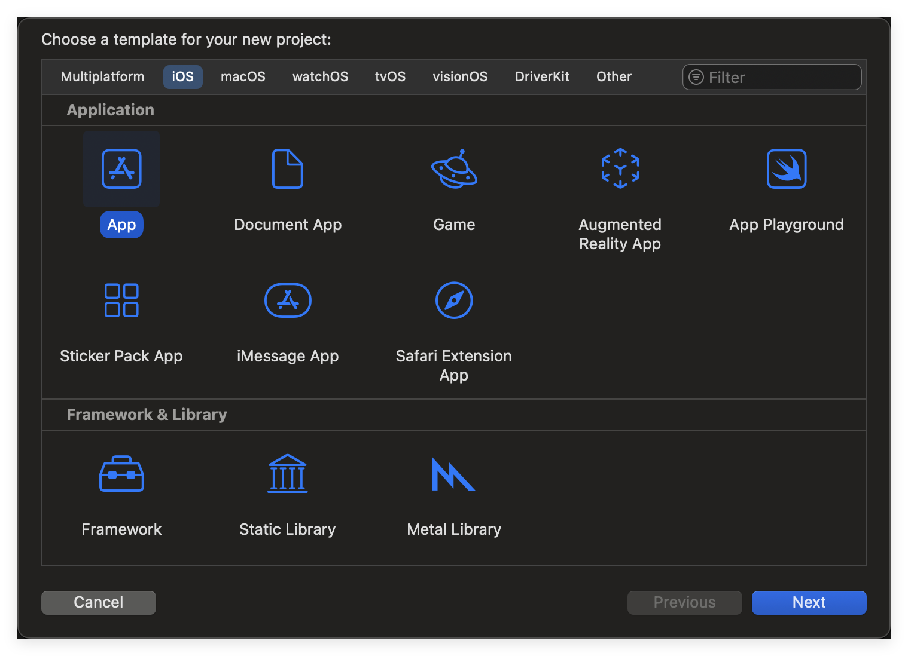
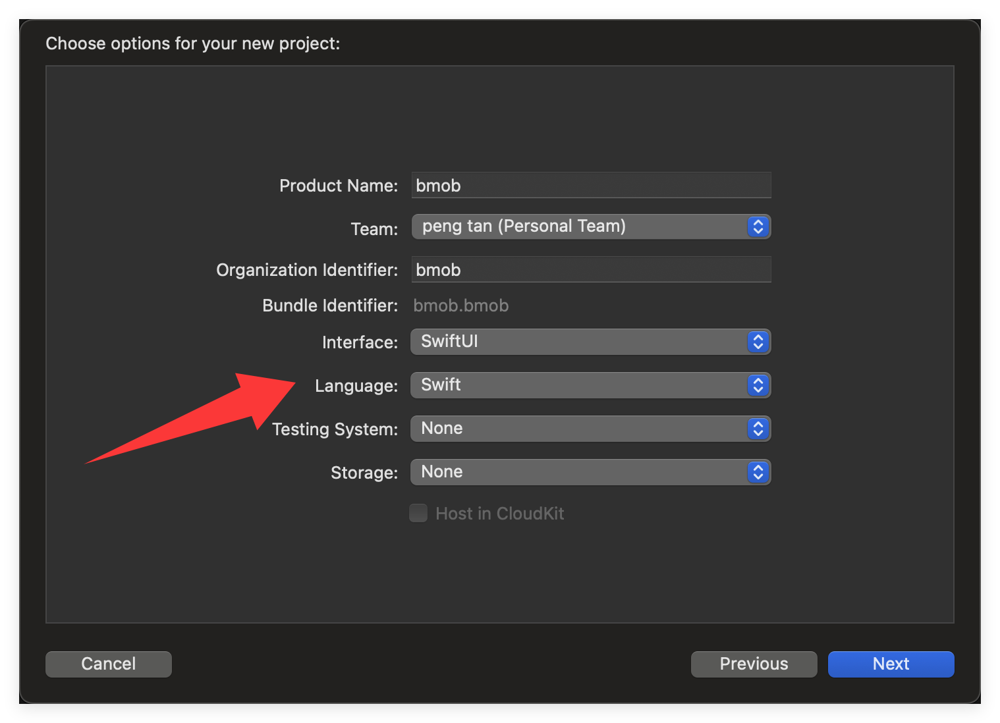
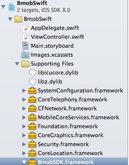
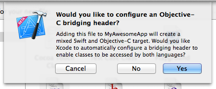
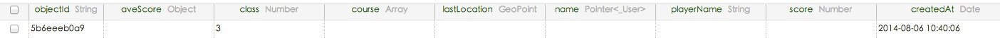

本文档的目的是为了方便大家在 Swift 工程中使用 BmobSDK，实现应用的快速开发。下面介绍怎么在 Swift 工程中使用 BmobSDK。

## 在 Bmob 上创建应用
关于如何创建应用，具体请参照[快速入门](https://doc.bmobapp.com/data/ios/)

## 创建 Swift 项目
使用 Xcode 创建一个新的 Single View Application



Language 选择 Swift



## 设置 BmobSDK

### 方式一：通过 CocoaPods 安装（推荐）

在项目根目录下创建 `Podfile` 文件，内容如下：

```ruby
target "你的项目名称" do
  platform :ios, "15.6"
  use_frameworks!
  pod 'BmobSDK'
end
```

> 将 `"你的项目名称"` 替换为你在 Xcode 中创建的实际项目名称。

然后在终端中进入项目目录，执行：

```bash
pod install
```

> **注意：** 使用 CocoaPods 安装完成后，请关闭当前的 `.xcodeproj` 项目文件，改为打开项目目录下新生成的 `.xcworkspace` 文件。后续所有操作都应在 `.xcworkspace` 中进行，否则会导致找不到 Pod 引入的库而编译报错。

### 方式二：手动导入 SDK

从https://github.com/bmob/Bmob-iOS-SDK下载最新的 BmobSDK,解压后将 SDK 文件(`BmobSDK.xcframework`)拖入项目中。

然后添加以下依赖库文件：

- Foundation.framework
- CoreLocation.framework
- Security.framework
- CoreGraphics.framework
- MobileCoreServices.framework
- CFNetwork.framework
- CoreTelephony.framework
- SystemConfiguration.framework
- AVFoundation.framework
- MediaPlayer.framework
- Photos.framework
- libz.1.2.5.tbd
- libicucore.tbd
- libsqlite3.tbd
- libc++.tbd
- libWeChatSDK.a（如果需要使用支付功能，必须导入，可从微信开放平台下载最新的）

添加完成后，应该像这个样子：



## 创建桥接头文件

由于 BmobSDK 是 Objective-C 编写的，在 Swift 项目中使用需要创建一个桥接头文件（Bridging Header）。

最快捷的方式是：在项目中新建一个任意名称的 Objective-C 文件（如 `test.m`），Xcode 会自动询问你是否创建桥接头文件，点击 **Create Bridging Header** 即可：



完成之后，你就可以删除 `test.m` 文件了。然后在生成的桥接头文件 `{你的项目名}-Bridging-Header.h` 中引入 BmobSDK：

```objc
#import <BmobSDK/Bmob.h>
```

## 测试 CRUD 功能

### 初始化 SDK

在 `testApp.swift` 中注册你的 AppKey（登录 [Bmob 控制台](https://www.bmobapp.com) 后，在 **应用设置 > 应用密钥** 中获取）：

```swift
import SwiftUI

@main
struct test202603App: App {
    init() {
        Bmob.register(withAppKey: "xxxxx")
    }

    var body: some Scene {
        WindowGroup {
            ContentView()
        }
    }
}
```

### 创建数据

在 `ViewController.swift` 中添加以下方法，用于向 `GameScore` 表插入一条数据：

```swift
func save() {
    let gamescore = BmobObject(className: "GameScore")
    gamescore.setObject("John Smith", forKey: "playerName")
    gamescore.setObject(90, forKey: "score")
    gamescore.saveInBackground { (isSuccessful, error) in
        if let error = error {
            print("保存失败: \(error.localizedDescription)")
        } else {
            print("保存成功")
        }
    }
}
```

然后在 `viewDidLoad` 中调用：

```swift
override func viewDidLoad() {
    super.viewDidLoad()
    save()
}
```

运行项目后，可以在 Bmob 控制台的后台查看是否创建成功，如下图所示：



### 查询数据

查询 `BmobUser` 表中的用户列表，按创建时间倒序排列：

```swift
func queryUsers() {
    let query: BmobQuery = BmobUser.query()
    query.orderByDescending("createdAt")
    query.findObjectsInBackground { (array, error) in
        guard let results = array else { return }
        for item in results {
            if let obj = item as? BmobUser {
                print("objectId: \(obj.objectId ?? ""), username: \(obj.username ?? "")")
            }
        }
    }
}
```

### 更新数据

根据 `objectId` 更新一条已有的 `GameScore` 记录：

```swift
func update() {
    let gamescore = BmobObject(outDatatWithClassName: "GameScore", objectId: "替换为实际的objectId")
    gamescore.setObject(91, forKey: "score")
    gamescore.updateInBackground { (isSuccessful, error) in
        if let error = error {
            print("更新失败: \(error.localizedDescription)")
        } else {
            print("更新成功")
        }
    }
}
```

### 删除数据

根据 `objectId` 删除一条 `GameScore` 记录：

```swift
func deleteGameScore() {
    let gamescore = BmobObject(outDatatWithClassName: "GameScore", objectId: "替换为实际的objectId")
    gamescore.deleteInBackground { (isSuccessful, error) in
        if let error = error {
            print("删除失败: \(error.localizedDescription)")
        } else {
            print("删除成功")
        }
    }
}
```

## 案例源码

[点击下载源码](https://github.com/bmob/bmob-ios-demo/blob/master/SwiftDemo.zip "点击下载源码")

更多问题请控制台工单联系我们
