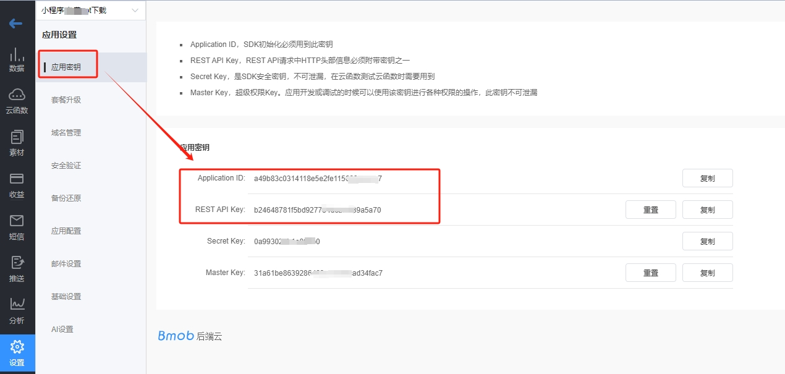
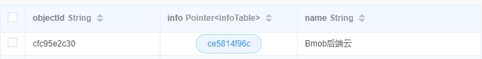
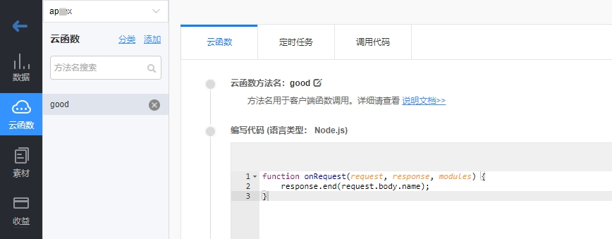

# Python Bmob开发文档

## 安装

在命令行中执行下面的代码安装Python-bmob包：

```pip
pip install python-bmob
```

## 初始化

注册Bmob后端云开发者账号，并创建应用，获取这个应用的`application id`和 `rest api key`，如下图。



创建python脚本文件，引入Bmob和创建Bmob对象进行初始化，代码如下：

```python
# 引入Bmob
from bmobpy import *

# 新建Bmob对象
b = Bmob("你的application id", "你的rest api key") 
```

其中，`application id`和`rest api key`是你在Bmob控制台上创建的应用密钥信息。

我们对数据的所有操作，都围绕着Bmob类进行。

## 快速入门

### 新增数据

```python
result = b.save('mytable',data={
	'name':'Bmob后端云',
	'age':11,
	'tags':['Bmob','Android','python'],
	'good':True
})
```

其中，`mytable`是你的数据表的名称，`data`是你要保存的数据的dict数据类型。
本示例中，`name`是字符串类型，`age`数字类型，`tags`是数组类型，`good`是布尔型。

除此之外，Bmob还支持更多的数据类型：

- 文件类型：`BmobFile(url, filename) `，其中，`url`是文件的网络路径，`filename`是文件的名称。
- 日期类型：`BmbDate(timestamp)` ，其中`timestamp`为到毫秒的时间戳。
- 地理位置类型：`BmobGeoPoint(latitude, longitude)` ，其中，`latitude`是纬度，`longitude`是经度。
- 指针类型：`BmobPointer(className, objectId)`，其中`className`是指向的数据表名称，`objectId`是指向的那条数据的`objectId`。

下面用代码举例说明：

- 文件类型的操作

如果你有文件的网络地址，如： https://www.bmobapp.com/static/img/footer-QR.585dbdf0.png ，你可以用下面的代码添加文件类型的数据：

```python
result = b.save('mytable',data={
	'name':'Bmob后端云',
	'myfile':BmobFile('https://www.bmobapp.com/static/img/footer-QR.585dbdf0.png','客服二维码')
})
```

如果你的文件是在本地，请查看文件服务一节。

- 日期类型的操作

示例代码如下：

```python
result = b.save('mytable',data={
	'name':'Bmob后端云',
    'date':BmobDate(datetime.datetime.now().timestamp()*1000)
})
```

- 地理位置类型的操作

示例代码如下：

```python
result = b.save('mytable',data={
	'name':'Bmob后端云',
    'address':BmobGeoPoint(23.12, 113.33)
})
```

- 指针类型的操作

```python
result = b.save('mytable',data={
	'name':'Bmob后端云',
    'info':BmobPointer('infoTable','ce5814f96c')
})
```

这里需要注意的是，执行这个代码前，你需要先在Bmob控制台上创建`infoTable`表，并且里面有一行数据的`objectId`为`ce5814f96c`。
如果一切正常，你会在控制台的`mytable`中看到下图这样的一行数据。



### 删除数据

```python
isOK = b.delete('mytable','93a9b6847f')
print(isOK)
```

其中，`mytable`是数据表的名称，`93a9b6847f`是要删除的那条数据对应的`objectId`。
如果删除成功，isOK返回True.

### 修改数据

```python
isOK = b.update('mytable','93a9b6847f',data={
    'name':'我爱Bmob后端云'
})
print(isOK)
```

其中，`mytable`是数据表的名称，`93a9b6847f`是要修改的那条数据对应的`objectId`，`data`存放要修改的数据的内容。
如果修改成功，isOK返回True.

### 获取单条数据

```python
r = b.getObject("mytable", "93a9b6847f")
print(r)
print(r.name)
```

其中，`mytable`是数据表的名称，`93a9b6847f`是要获取的那条数据的`objectId`。
如果成功，r返回这条数据的对象信息。

### 获取多条数据

```python
rs = b.findObjects('mytable')
for r in rs:
    print(r.name)
```

其中，`mytable`是数据表的名称。`findObjects`方法可以实现非常复杂的查询功能，包括排序、分页、包含、指定返回列等等。更多的用法请查看复杂数据查询文档。

## 文件操作

### 上传文件

执行Bmob类的`upload`方法，传本地文件的路径作为唯一的参数，可以将本地文件上传到Bmob后端云的CDN上面去，代码如下：

```python
bmobFile = b.upload('d:/abc.pdf')
print(bmobFile.url)
print(bmobFile.filename)
```

成功之后，会直接返回`BmobFile`类的实例，你可以用如下的代码，新增一条记录到Bmob数据库中。

```python
isOK = b.save('mytable',data={
    'myfile':bmobFile
})
print(isOK)
```

需要注意的是：
- 如果你想查看上传后的文件（即：下载文件），需要购买开通文件的二级域名服务，或者用自己的备案域名接入文件域名服务。
- 你也可以不用`BmobFile`这种数据类型进行存储，而是直接获取`url`，作为字符串存储在Bmob的数据表中。

### 删除文件

执行Bmob类的`delFile`方法，将本地上传到Bmob CDN上的`url`作为唯一的参数，即可删除，代码如下：

```python
isOK = b.delFile('https://bmob-cdn-31082.bmobpay.com/2024/04/13/d79f988a409b4678803e7093e6c78aa8.png')
```

删除成功，返回是否成功的bool类型。

## 调用云函数

在本示例中，我们需要先创建一个名为`good`的云函数，这个云函数的代码的功能非常简单，直接返回从post上来的数据，如下图：



在python中调用这个云函数的代码如下：

```python
rs = b.functions('good',body={'name':'Bmob'})
print(rs)
```

## 短信服务

### 发送短信验证码

使用Bmob类的`requestSMSCode`方法，提供`手机号码`作为参数，可以快速调用发送短信验证码的功能,代码如下:

```python
rs = b.requestSMSCode('13800138001')
print(rs)
```

发送成功的话，会返回这条短信验证码的标记信息。

如果你想修改默认的短信验证码模板，你可以先在Bmob控制台创建验证码模板，待审核通过之后，再修改`requestSMSCode`方法，代码如下：

```python
rs = b.requestSMSCode('13800138001','你的短信验证码模板名称')
print(rs)
```

### 检查短信验证码是否正确

```python
rs = b.verifySmsCode('13800138001','785871')
print(rs)
```

其中，`785871`是用户收到的短信验证码。如果验证成功，返回True。

## 复杂查询

针对复杂的数据查询，我们提供了支持链式调用的`BmobQuery`类，配合Bmob类的`findObjects`方法一起使用，下面举一些例子进行说明：

### 获取某个字段值等于某个值的所有记录

```python
query = BmobQuery().addWhereEqualTo('name','Bmob后端云')
rs = b.findObjects('mytable',where=query)
for r in rs:
    print(r)
```

### 查询数组列中的某个列的值等于某个值

下面的代码可以查询`tags`列中有`Android`或者`good`值的所有数据。

```python
query = BmobQuery().addWhereContainedIn('tags',['Android','good'])
rs = b.findObjects('mytable',where=query)
for r in rs:
    print(r)
```

### 用include参数来获取指针指向的那行数据

如果你还想获取到`info`列（指针类型的类）对应的那行数据的详细信息，你就需要在调用`findObjects`时，指定`include`参数，代码如下：

```python
query = BmobQuery().addWhereContainedIn('tags',['Android','good'])
rs = b.findObjects('mytable',where=query,include=['info'])
for r in rs:
    print(r)
```

其中，`info`是指针类型的列。

### 获取指定条数的数据

默认情况下，`findObjects`方法返回查询到的 `最多100条` 记录，这通常很消耗网络带宽。为解决这个问题，你可以使用`limit`参数，代码如下:

```python
query = BmobQuery().addWhereContainedIn('tags',['Android','good'])
rs = b.findObjects('mytable',where=query,limit=50)
for r in rs:
    print(r)
```

### 跳过前面的一些数据

在进行分页开发的时候，你通常还需要`skip`参数，配合`limit`参数一起使用。`skip`参数可以跳过查询结果中的一定条数，代码如下：

```python
query = BmobQuery().addWhereContainedIn('tags',['Android','good'])
rs = b.findObjects('mytable',where=query,skip=5)
for r in rs:
    print(r)
```

### 对查询结果进行排序

你可以用`findObjects`方法的`order`参数对查询结果进行排序，代码如下：

```python
query = BmobQuery().addWhereContainedIn('tags',['Android','good'])
rs = b.findObjects('mytable',where=query,order='createdAt')
for r in rs:
    print(r)
```

上述代码表示按创建时间进行升序排列，如果你想按创建时间进行降序排列，只需要在 `createdAt` 的前面加上 `-` 号，即修改代码如下：

```python
rs = b.findObjects('mytable',where=query,order='-createdAt')
```

### 返回指定的列

默认情况下，`findObjects`会返回表中的所有列的数据，但很多时候，这会浪费带宽和影响相应速度，为此，我们可以用`keys`参数来指定返回需要的列，代码如下：

```python
query = BmobQuery().addWhereContainedIn('tags',['Android','good'])
rs = b.findObjects('mytable',where=query,keys=['name','address'])
for r in rs:
    print(r)
```

## 统计查询

### 计数

如果你想知道你的数据有多少条，你就可以用`count`方法，进行计数查询，代码如下：

```python
query = BmobQuery().addWhereContainedIn('tags',['Android','good'])
num = b.count('mytable',where=query)
print(num)
```

### 求和

有时候，你想知道总和的数据，比如了解一个月的收入，那就可以用`sum`方法，进行求和查询，代码如下：

```python
query = BmobQuery().addWhereEqualTo('isFree',False) 
rs = b.sum('mytable', ['count','money'], where=None)
print('求和结果',rs)
```

上面的代码中，我们对`count`列和`money`列同时进行求和。

### 最大值

用`max`方法，可以查到对应列的最大值，代码如下：

```python
query = BmobQuery().addWhereEqualTo('isFree',False) 
rs = b.max('mytable', ['money'], where=None)
print('最大值结果',rs)
```

### 最小值 

用`min`方法，可以查到对应列的最小值，代码如下：

```python
query = BmobQuery().addWhereEqualTo('isFree',False) 
rs = b.min('mytable', ['money']', where=None)
print('最小值结果',rs)
```

### 平均值

用`mean`方法，可以查到对应列的平均值，代码如下：

```python
query = BmobQuery().addWhereEqualTo('isFree',False) 
rs = b.mean('mytable', ['money'], where=None)
print('最大值结果',rs)
```

## 用户操作

***以下操作针对Bmob控制台中默认创建的`_User`表进行。***

### 账号密码注册

示例代码如下:

```python
rs = b.signUp('注册账号','注册密码', userInfo={
    'sex':True,
    'age':100
})
print(rs)
```

### 账号密码登录

示例代码如下:

```python
rs = b.login('13512707963','123456')
print(rs)
```
登录成功，返回这条用户记录的信息。

### 邮件重置密码

示例代码如下:

```python
rs = b.resetPasswordByEmail('这条记录对应的邮箱地址')
print(rs)
```

发送成功，返回True。如果查不到对应的邮箱地址或者其他错误，返回False。

### 旧密码方式修改用户密码

示例代码如下:

```python
rs = b.updatePassword('这个用户数据对应的objectId', '旧密码', '新密码')
print(rs)
```

### 短信验证码重置密码

示例代码如下:

```python
rs = b.resetPasswordBySMSCode('收到的短信验证码','新密码')
print(rs)

```