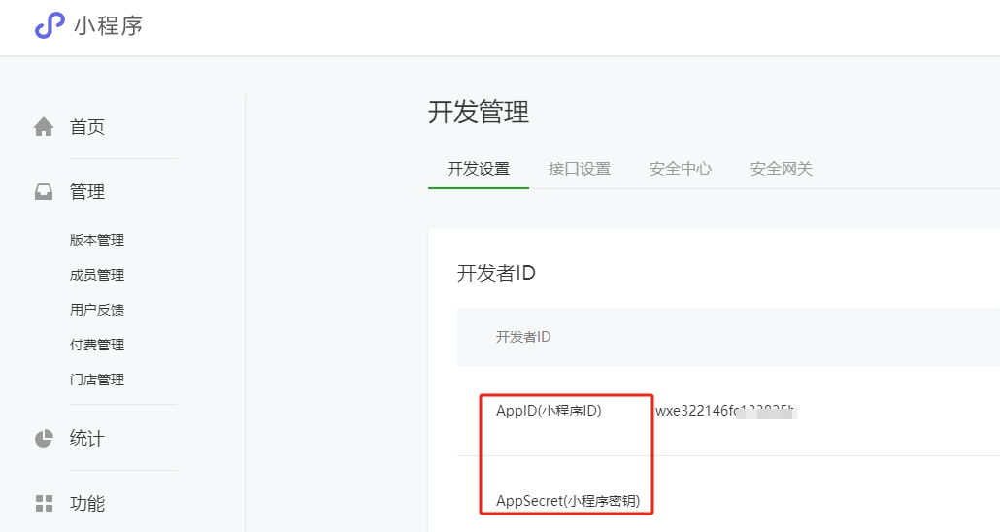
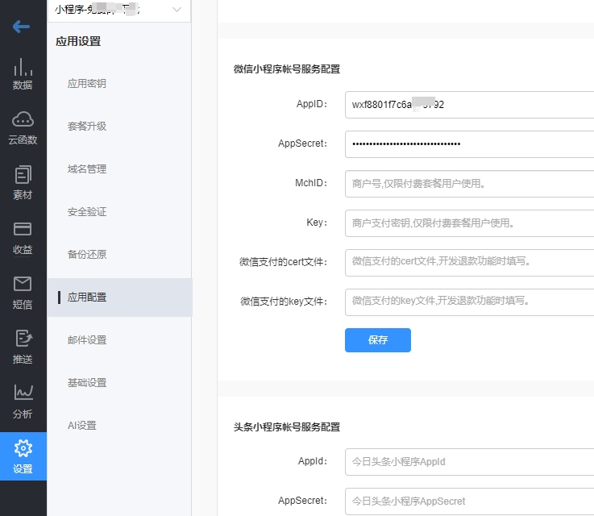
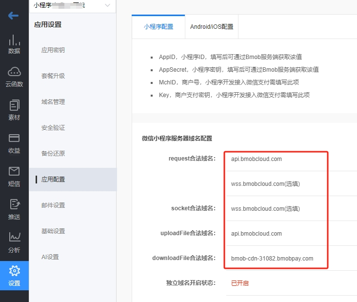
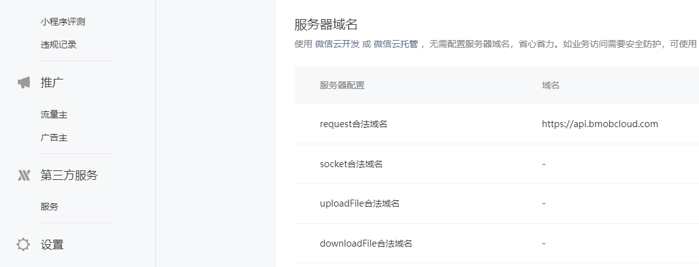
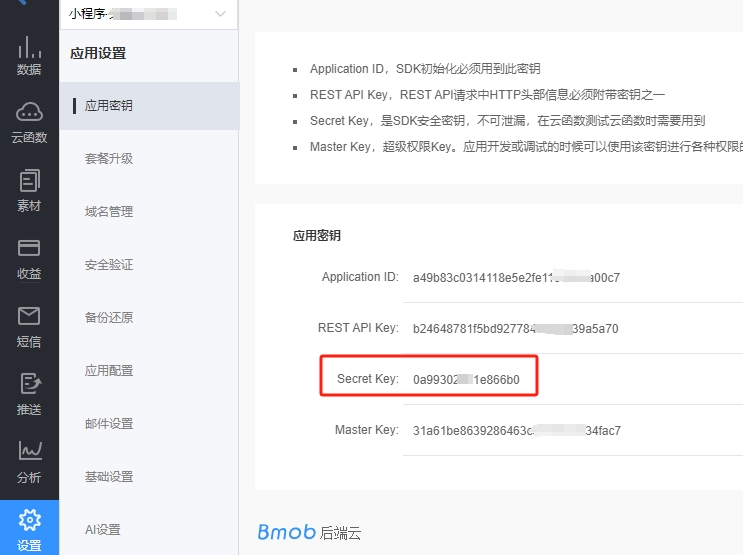
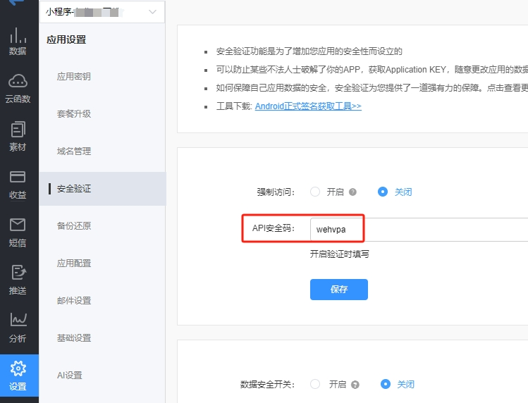
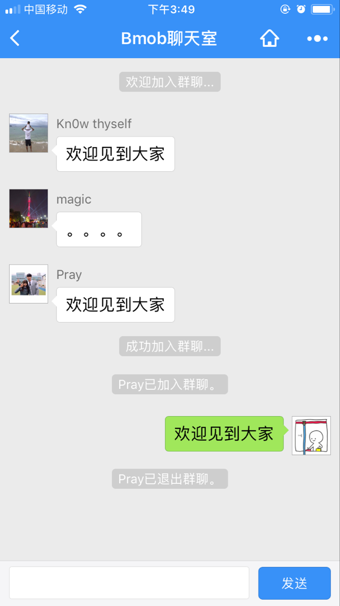

## 创建你的Bmob应用

登录Bmob后端云控制台，点击后台界面左上角“`创建应用`”，在弹出框输入你应用的名称，然后确认，你就拥有了一个待开发的应用。


## 配置小程序密钥和获取应用密钥

登录微信的[小程序开发者后台](https://mp.weixin.qq.com/)，依次点击` 开发管理 -> 开发设置`，在`开发者ID`一栏中，获取`AppID(小程序ID)`和`AppSecret(小程序密钥)`。



回到Bmob后端云控制台，进入到你刚刚创建的应用中，依次点击` 设置 -> 应用配置`，在 `微信小程序帐号服务配置` 一栏中，将刚刚获取到的 `AppID` 和 `AppSecret` 对应填写上去。



## 配置小程序服务器域名

在Bmob后端云控制台，你刚刚创建的应用中，依次点击 `设置 -> 应用配置`，在`微信小程序服务器域名配置` 一栏中，你可以看到 `request合法域名`、`socket合法域名`、`uploadFile合法域名`和 `downloadFile合法域名` ，如下图所示。



将这些合法域名对应填写到 微信的小程序开发者后台中（依次点击 `开发管理 -> 开发设置`，在 `服务器域名` 一栏中）。这里需要注意的是，你只需要填写你用到的服务域名。比如，你只用到了数据访问，那就只需要填入Bmob控制台中提供的 `request合法域名` 。如下图所示：




## 安装

```
npm install hydrogen-js-sdk
```

以上方式仅支持在 `nodejs` 环境下的安装，更多的安装和引用方式可查看我们详细的[开发文档](https://doc.bmobapp.com/data/wechat_app_new/)。

## 引入和初始化

引入和初始化代码如下：

```
import Bmob from "hydrogen-js-sdk";
Bmob.initialize("你的Secret Key", "你的API 安全码");
```

其中，`Secret Key`在Bmob控制台`你创建的应用 -> 设置 -> 应用密钥-> Secret Key` 中找到。
`API 安全码`在Bmob控制台`你创建的应用 -> 设置 -> 安全验证-> API安全码` 中进行设置。




### 查询表中数据

示例代码如下：

```
const query = Bmob.Query("tableName");
query.find().then(res => {
    console.log(res)
});
```

`tableName`是你在Bmob控制台你的应用中创建的表的名称，`res`返回这个表的数据集合，默认是按`创建时间`排序的`100`条记录。

更多增删改查的例子，请查看我们详细的[开发文档](https://doc.bmobapp.com/data/wechat_app_new/)。


## WebSocket 通讯（聊天）
### 使用实时数据平台的js

1、对实时数据对象进行初始化

```
let BmobSocketIo =new Bmob.Socket()
```

###

2、监听表

```

    //初始连接socket.io服务器后，需要监听的事件都写在这个函数内
    BmobSocketIo.onInitListen = function () {
      //订阅Chat表的数据更新事件
      BmobSocketIo.updateTable("Chat"); //聊天记录表
    };

    //监听服务器返回的更新表的数据
    BmobSocketIo.onUpdateTable = function (tablename, data) {

      if (tablename == "Chat") {
        console.log(data);
      }
    };

```

PS:更多请参考Bmob Demo里面的群聊功能。



## 优秀开源

1. ### 地道美食地图
> 点击查看[地道美食地图](https://github.com/LanceCong/gourmet_map)


2. ### 出发吧一起
> 点击查看[出发吧一起](https://github.com/dmego/together)

3. ### 心邮
> 点击查看[心邮](https://github.com/bmob/Bmob-wechatapp-xinyou)

4. ### 自媒体文章小程序
> 点击查看[自媒体文章小程序](https://github.com/qfwc258/weapp-bmob-cw)

5. ### 灵动云课堂小程序端
> 点击查看[灵动云课堂小程序端](https://gitee.com/laeser/course)

6. ### 灵犀外卖
> 点击查看[灵犀外卖](https://gitee.com/laeser/dinner)


## Bmob入门示例
* 源码包含增删改查

[快速入门相关源码下载](https://github.com/magic007/wechatAppDemo "快速入门相关源码下载")


## 混合开发示例

地址：

https://github.com/bmob/ithome-lite

源码基于`MPVUE` 框架发布时，可以生成小程序源码、H5源码

## 部分小程序案例

-------

### 小程序

1.生日工具                    -------工具类

2.足迹地图

3.接力喵视频                -------视频类

4.像素涂鸦

5.地道美食地图           -------LBS

6.胖熊圈

7.有货Hk  --已改名

8.厦漳泉生活通               -------本地生活

9.极简笔记

10.衣在线                  -------商城

11.活动报名表                -------工具类

12.味蕾点餐               -------点餐

13.烟台微拼               -------本地生活

14.顺德便利贴

15.同城生活广告

16.点点英语学堂

17.朝露时刻

18.青岛一起秀科学俱乐部

19.纸塘

20.雷湖古琴艺术

21.皋城文明随手拍   -----政府

22.阅后即焚图片分享

23.猎位共享停车               线下智能停车

24.听写宝

25.嘿车出行（已改名称）

26.喵星人宠物社区

27.标签生成器

28.视频看房

29.海南黎家特产

30. 轩宇工具

31.在旅途看世界

32.寻遍美食地图

33.Bmob示例

34. 鲁山拼车

33.莲馨图书室          图书馆-扫描借书

34.灵动云课堂

35.9cam               视频类

36.恋爱迹

37.融信品质生活服务

38.全民摄影秀

39.农电微服务    国家电网公司

40.壁纸印象

41.跟妆师

42.高能名片

43.婚纱lite

44.张阿姨打扫

45.吃决策          烟台大学饭堂

46.比心比价

47.蜂鸟作业               教育

48.美味面包lite

51.幸福的5班

52.大武汉公交               交通

53.Buy优选

54.码赚

55.附近的圈子

56.吴忠意大利冰淇淋          实体店点餐

57.摩西讲单词     教育

58.贝莱福居

59.花间集鲜花

60.柏亚阅读书吧

61.找我跑腿服务

62.橙色工地圈

63.大学城活动报名

64.聚合助手

65.圆桌绿色版

66.我的王者名片

67.趣猫

68.管图智能选座          大学图书馆

69.呼伦贝尔二手车平台

70.我的王者名片

71.万能服           答题应用

72.国关campus

73.礼信APP

74.一起冒险

75.出发吧一起

76.闪电速代助手

77.一锅美味   点餐

78.月兴米粉面店   批发

79.电控之家服务

80.婚礼问答百科

81.hd56

82.冲顶大会复活卡

83.婚礼百科问答

84.报名猫

85.天天现金流

86.附近废品哥

87.郴州拼车圈

88.自驾游组织

89.好习惯养成

90.滴滴帮

91.火星工作室设计开发

92.春节拜年神器          视频

93.很有义思

94.云餐豹               餐饮

95.拧瓶盖

96.你画我猜世界杯

97.野原之森林计算机工作室

98.爱邻成长系统

99.附近的小摊

100.南京私人代驾

101.夜猫盒子          扫描

102.钓鱼技巧666

103.吉县同城便民信息

104.小熊头像

105.新视窗家政服务

106.答题星Plus

107.职前公社

.....


### 小程序游戏

1.最强大脑之数字华容道

2.弹球明星

3.棋头并进		多人实时数据对战

4.最强钓鱼人


>官方交流QQ群：372103594 。欢迎提交给我们
