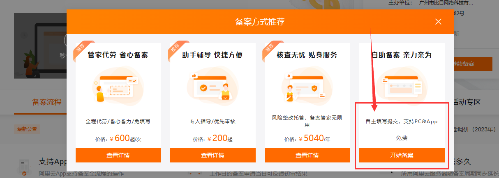
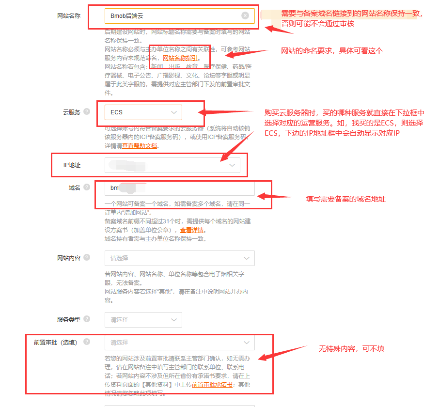
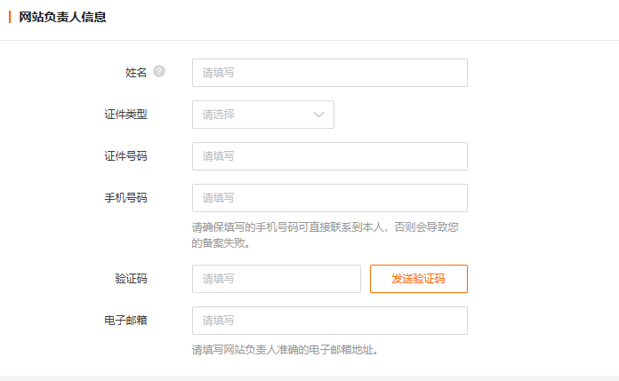
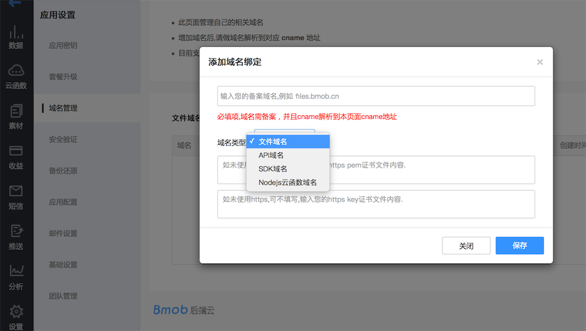
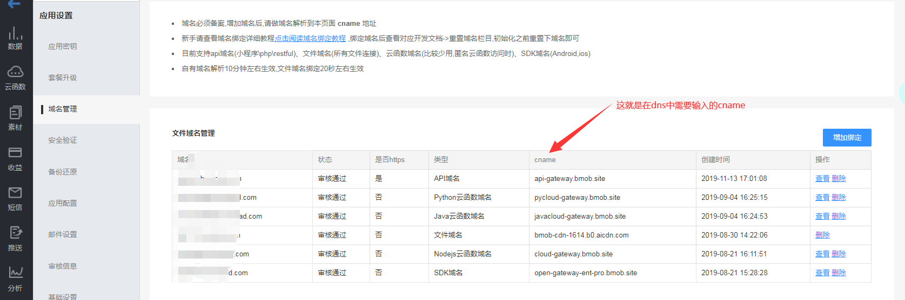
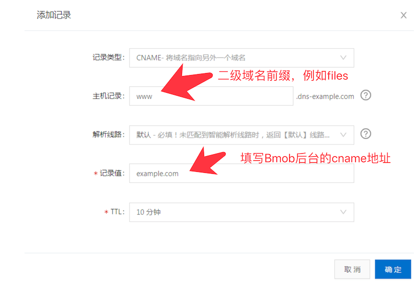

## 独立域名绑定教程


## 备案说明

备案

**备案说明**

根据有关法律法规和部门规定，使用云服务需绑定自有域名，如用户已有备案域名（主域名和子域名均可），则可直接接入使用相关云服务；如无备案域名，则需购买域名进行备案。对于需要时间进行备案的新应用，管理后台提供限制请求数目的测试域名，以便用户进行初期体验和测试，用户正式上线应用前需改用自有域名。

 

**域名备案教程**

对于需要进行备案的用户，提供如下备案教程作为参考，以帮助开发者顺利备案。

**一、备前前提**

1、购买备案域名

说明：准备需要备案的域名（购买方式：进去域名购买网页https://wanwang.aliyun.com/，然后检索自己想要的域名，购买，普通域名几块钱一个），域名需要实名认证（个人域名就个人认证，企业域名就企业认证），域名备案主体要与实名认证信息相符合。
 2、购买备案服务器（如果已有服务器就不需要再买）

说明：用同一个阿里云账号在阿里云购买大陆地域的ECS云服务器、虚拟主机、轻量应用服务器等（如果只需要备案，买最便宜的就可以），同一个账号下，在[ICP备案](http://beian.aliyun.com/)过程中直接选择对应的服务器类型就可以。如果购买服务器和申请ICP备案不是同一个阿里云账号，则需要去申请ICP备案服务码（[申请（免费）ICP备案服务码 (aliyun.com)](https://help.aliyun.com/document_detail/36938.html?spm=5176.21213303.J_6704733920.11.639853c9S5A0vq&scm=20140722.ID_qacard@@gtsqa@@29161.P_180.MO_1342-ST_6739-V_1-ID_qacard@@gtsqa@@29161-OR_rec-RL_阿里云备案服务号申请方法及说明)）。

所以尽量域名和服务器用同一个账号购买。

3、准备备案材料

说明：包含个人备案需要身份证图片、《网站备案真实性核验单》（核验单在备案过程中即可下载，按照流程操作即可），由于当地管局备案规则不同，有可能还需要域名证书，域名证书需要去域名注册商网站上获取。企业备案需要营业执照、备案负责人和网站负责人身份证件照片、《网站备案真实性核验单》，另外，由于当地管局备案规则不同，有可能需要其他证明材料，在操作过程中，按照要求准备材料即可。

**二、具体备案过程（以阿里云为例）**

**1.****登录阿里云网站，在检索框中检索“备案”，进入备案有关页面，可选择免费备案，具体地址如下：**

[网站备案_ICP备案_备案迁移_备案-阿里云 (aliyun.com)](https://beian.aliyun.com/?spm=5176.21213303.J_6704733920.7.4f7653c9clDIkF&scm=20140722.S_product%40%40云产品%40%40999996._.ID_product%40%40云产品%40%40999996-RL_备案-LOC_main-OR_ser-V_2-RK_rerank-P0_0)





2.根据网页提示，填写有关内容



如果有备案服务码，直接填写备案服务码


填写说明：

网站名称：按实际填写，具体规则可参考“网站名称指引”；

云服务：最简单的就是同一账号买域名、最便宜的轻量应用服务器（备案要求买3个月及以上，就买3个月就行，如果是新用户，一般有优惠）和进行备案，买的哪种服务器，就在下拉列表中选择相应的内容，如买了ECS，就选ECS，下边的IP框中会自动显示对应IP。

3.根据网站提示，如实填写网站负责人信息和其他信息，并上传有关证件，进行实名认证。

这里个人不需要填写，企业备案填写以下内容



 

4.页面资料填写完成后，根据提示下载阿里云APP，控制台-ICP备案，根据提示提交有关资料，进行认证。（以前是要寄回资料给阿里云进行认证，现在下载APP，提交资料认证就快很多）

 

**三、等待审核**

1.阿里云初审：提交备案后，阿里云将在1个工作日进行初审，请确保保持备案信息中的联系电话畅通以便阿里云备案工作人员与您核实信息。

2.阿里云初审通过没有问题后，阿里云将在1个工作日内将备案信息提交省通信管理局审核。部分地区，用户需完成短信验证后，备案申请才能成功提交管局审核，所以要留意信息。

3.等待，大约需要等待3-20个工作日，此过程与阿里云无关，此时的等待时间以各地通信管理局审核时间为准。管局审核通过后，将以短信及邮件形式通知到用户。

4.上述备案流程是以阿里云为例，腾讯云、华为等其他平台也提供相关服务，用户可自行选择，备案流程相似。

 

 

**四、总结**

整个过程：

1.用户需要购买域名（没有太高要求的话就，几块钱就可以买一个）；

2.购买三个月的服务器（备案方强制要求没办法，普通旧账号3个月一般是100多块，学生新账号有很大优惠，备案后就不需要续费了，域名备案后一劳永逸，很多地方可以用得上自己的备案域名，建议开发者初期突破困难，备案一个自有域名）；

3.最后到有关平台备案，整个过程是7-30天左右，准备越充分，备案越顺利。

希望能帮助到大家顺利备案！

 

 

 


## 文件域名绑定教程


1.第一步：控制台->应用设置->域名管理

>  备案域名，这里需要注意的是，一般使用二级域名例如：files.xxxx.com




添加域名成功后，就会出现需要在DNS服务商网站上需要的CNAME记录，如下图：



第二步：进入域名管理商，修改 CNAME 记录

登入域名的 DNS 服务商网站，修改 CNAME 记录，具体配置方法可参见如下链接：

[DNSPod CNAME 接入 CDN](https://support.dnspod.cn/Kb/showarticle/tsid/32/?spm=5176.doc27112.2.16.GAMn1f)

[新网 CNAME 接入 CDN](http://www.xinnet.com/service/cjwt/domain/guanli/1164.html?spm=5176.doc27112.2.17.GAMn1f)

[万网 CNAME 接入 CDN](https://help.aliyun.com/document_detail/29725.html?spm=5176.doc27112.2.15.jhFGwZ)


域名解析添加cname解析




第三步：验证 CNAME 配置是否生效

因 DNS 解析记录都有缓存时间，CNAME 的生效时间一般是 600s，可通过 ping 所配置的加速域名，检验 CNAME 配置是否生效，如果后缀显示为 aicdn.com，则证明 CNAME 配置已生效，即加速业务正式开始启用。文件域名如下所示：

```
➜  ~ ping cdn.xxxxxx.com
PING nm.aicdn.com (58.222.18.2): 56 data bytes
64 bytes from 58.222.18.2: icmp_seq=0 ttl=55 time=33.468 ms
64 bytes from 58.222.18.2: icmp_seq=1 ttl=55 time=31.251 ms
64 bytes from 58.222.18.2: icmp_seq=2 ttl=55 time=32.382 ms
64 bytes from 58.222.18.2: icmp_seq=3 ttl=55 time=31.797 ms
```


## API域名绑定教程

API域名也就是restful 域名，绑定教程与文件域名完全一致，在第三步验证是否生效的操作下，可以访问自己绑定API域名与 自己备案域名 内容是否一致，一致则绑定成功。


## SDK域名绑定教程

SDK域名也就是APP SDK使用域名，绑定教程与文件域名完全一致，在第三步验证是否生效的操作下，可以访问自己绑定SDK域名与 open2.bmobapp.com 内容是否一致，一致则绑定成功。

SDK要让绑定的域名生效，还需要重置域名：

请直接参考：

[android重置域名设置](http://doc.bmobapp.com/data/android/develop_doc/#_71)

[iOS重置域名设置](http://doc.bmobapp.com/data/ios/develop_doc/#_5)

## 云函数域名绑定教程

云函数域名也就是平时使用的cloud.bmobapp.com 域名，绑定教程与文件域名完全一致，在第三步验证是否生效的操作下，可以访问自己绑定SDK域名与 cloud.bmobapp.com 内容是否一致，一致则绑定成功。